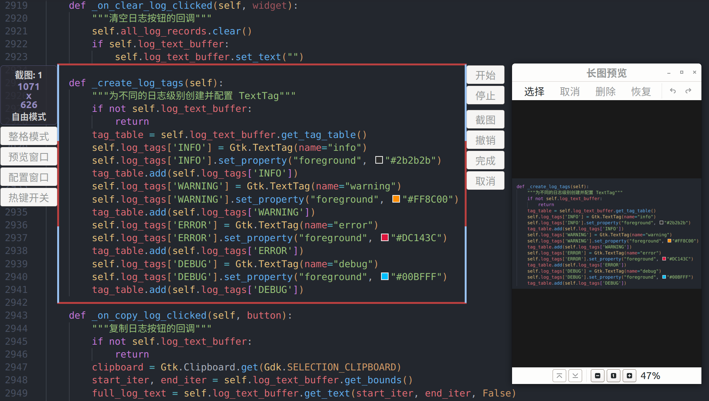
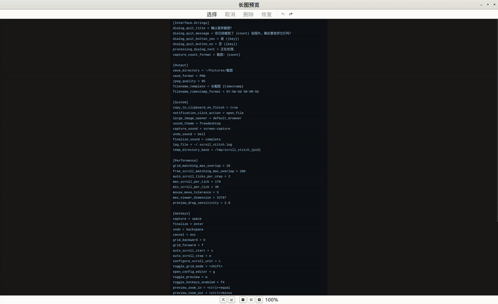
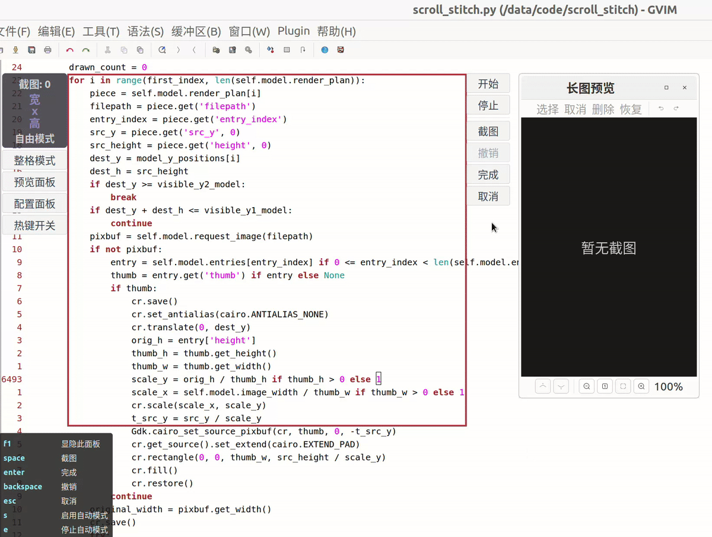

# 拼长图

- [简介](#简介)
- [特性](#特性)
- [功能概览](#功能概览)
    - [主窗口界面](#主窗口界面)
    - [误差修正](#误差修正)
    - [预览窗口](#预览窗口)
    - [截图模式](#截图模式)
        - [自由模式](#自由模式)
        - [自动模式](#自动模式)
        - [整格模式](#整格模式)
    - [核心操作](#核心操作)
    - [默认快捷键](#默认快捷键)
    - [配置介绍](#配置介绍)
- [快速开始](#快速开始)
- [限制](#限制)
- [安装](#安装)
    - [python 依赖](#python-依赖)
    - [外部依赖](#外部依赖)
    - [权限要求](#权限要求)
    - [运行程序](#运行程序)
    - [设置快捷键](#设置快捷键)
- [常见问题](#常见问题)
- [贡献](#贡献)
- [许可证](#许可证)

## 简介

一个运行在 `Linux/X11` 平台上的高度可配置的长截图工具。


## 特性

- **截图与拼接**：具有自由、自动、整格三种截图模式，实现自动/辅助截图
- **长图预览**：通过交互式预览窗口可以实时预览拼接效果并编辑
- **系统集成**：支持桌面通知、操作音效、打开文件或目录以及自动复制到剪贴板
- **高度自定义化**：从热键、界面、输出，到布局和交互，大多可以通过图形化界面配置

## 功能概览

以下为拼长图界面与行为默认配置的简单介绍，如果想更加详细的了解，请看[详细介绍](docs/详细介绍.md)文档。

### 主窗口界面


主窗口的界面布局是动态的，以确保不影响截图区域选择。

[动态布局演示](assets/动态布局演示.gif)

### 误差修正

[误差修正演示](assets/误差修正演示.gif)

启用误差修正后，左右边框上面的蓝色部分高度即为误差范围，拼接时只需将下边框附近内容移动到蓝色区域内即可（不要移过头），范围内的误差会被修正

整格模式下，误差基本只有几个像素，有些应用则没有误差，不建议对没有误差的应用启用误差修正。


### 预览窗口



预览窗口可以查看图片拼接效果，支持交互。能够调整窗口大小，拖动/滚动、放大/缩小图片，并会实时更新图片，自动滚动到图片底部（如果没有手动干预）

此外，还可以进入选择模式，对长图进行删除（删除选区，用来修复内容重复）、恢复（恢复选区内的接缝，配合删除用来修复内容缺失）



### 截图模式

#### 自由模式

[自由模式演示](assets/自由模式演示.gif)

自由模式是程序启用时默认的模式。

自由模式下主窗口边框可以自由拖动，窗口的高度也可以是任意的。

#### 自动模式



开启自动模式后，程序会自动滚动并拼接，可以通过快捷键或移动鼠标停止。

当程序检测到界面内容无太大变化时，会认为到达页面底部而自动停止。

#### 整格模式


要对一个应用窗口启用整格模式，必须先配置它的滚动单位（在这个应用窗口中鼠标滚轮滚动一格时，屏幕滚动的距离的像素数，可以使用快捷键开启自动配置）。

在整格模式下，主窗口的高度只能是滚动单位的整数倍，前进/后退的行为分别是先截图再前进一个截图区域的高度、撤销并后退一个截图区域的高度。

### 核心操作

- **区域选择与调整**：主窗口边框在没有截图的时侯可以自由拖动

  [区域选择与调整演示](assets/区域选择与调整演示.gif)

  在有截图的时候，窗口的宽度和左右边框的位置是锁死的
- **按钮功能**
    - **开始/停止**：开启/停止自动模式
    - **截图**：截取截图区域内容（不包括边框）
    - **撤销**：尝试删除截取的最后一张图片
    - **完成**：将截图拼接成一张图片并保存（完成后会有桌面通知）
    - **取消**：退出程序（退出前会有确认对话框，如果没有截图则直接退出）
    - **前进/后退**：整格模式下截图/撤销并将窗口滚动一个截图区域的高度
    - **整格模式**：切换整格模式
    - **预览窗口**：激活/隐藏预览窗口
    - **配置窗口**：激活/隐藏配置窗口
    - **热键开关**：启用/禁用全局热键
  
### 默认快捷键

拼长图支持快捷键操作，默认设置如下：

- **主要操作**  
  这些快捷键和对应的图形按钮的功能是一样的
    - 截图：`space`
    - 撤销：`backspace`
    - 完成：`enter`
    - 取消：`esc`
- **退出对话框操作**  

  [退出对话框](assets/退出对话框.png)

    - 退出对话框确认：`space`
    - 退出对话框取消：`esc`
- **模式与工具**
    - 开始自动滚动：`s`
    - 停止自动滚动：`e`
    - 切换整格模式：`<shift>`
        - 整格前进：`f`
        - 整格后退：`b`
    - 配置滚动单位（自由模式下）：`c`  
      
      [配置滚动单位演示](assets/配置滚动单位演示.gif)
      
      配置前，请确保界面内容丰富且有足够的滚动空间，配置时，程序会自动滚动界面，请不要移动鼠标
    - 激活/隐藏预览窗口：`w`  
      
      若预览窗口不可见则激活（不存在则创建），若可见（可视度大于 50%）则隐藏
        - 预览窗口放大：`<ctrl>+equal`
        - 预览窗口缩小：`<ctrl>+minus`
      
        预览窗口放大/缩小快捷键仅在预览窗口有焦点时有效
    - 激活/隐藏配置窗口：`g`  
      
      若配置窗口不可见则激活（不存在则创建），可见则隐藏
    - `f4`: 启用/禁用全局热键  
      
      程序开始时全局热键默认启用，禁用全局热键不包括其本身（当主窗口本身拥有焦点时，所有快捷键还是会生效）。

### 配置介绍

拼长图提供了图形化配置窗口，可以通过它查看与自定义程序行为和界面。当鼠标悬浮在配置窗口的大部分配置项上面都会有提示文字，如果想进一步了解，可以看[详细介绍/配置指南](docs/详细介绍.md#配置指南)一节。

## 快速开始

1. **启动程序**：在终端运行命令或通过快捷键启动拼长图 （启动方法见[运行程序](#运行程序)这一部分）
2. **选择区域**：单击窗口或拖动鼠标选择初始截图区域
3. **调整区域**：按住并拖动边框调整截图框的初始大小和位置
4. **滚动并截图**：
    - 自动模式：开始后按快捷键或移动鼠标停止
    - 自由模式：需要记住上一张截图底部区域的位置
        - 启用误差修正：将下边框附近的内容滚动到上边框蓝色区域内，范围内的误差会自动被修正
        - 不启用误差修正：将截图区域的底部恰好滚动到顶部（至少不要滚过头），让图片在空白区域拼接
    - 整格模式：通过前进/后退来滚动界面，默认的前进动作是截图后滚动，目标结束位置进入截图区域不代表截取到了这部分
5. **预览并编辑**：在预览窗口中预览拼接效果，删除底部多余内容，如果有内容重复则删除，如果有内容缺失则恢复后删除
6. **完成**：按下回车，完成拼接后会有桌面通知，点击可以查看图片

## 限制

拼长图目前只能运行在 `Linux` 平台的 `X11` 会话中。

命令行输入

```shell
echo $XDG_SESSION_TYPE
```

如果输出是 `x11`，就是 `x11` 会话，如果输出是 `wayland` 就是 `wayland` 会话。

## 安装

### `python` 依赖

`python` 版本要求 3.7.4+

`python` 包版本要求：

```txt
Pillow>=3.0.0
python-xlib>=0.16
evdev>=0.6.0
numpy>=1.14.5
opencv-python>=3.4.2.17
pycairo>=1.13.1
PyGObject>=3.31.2
# 对于某些 Linux 发行版（如 Ubuntu 22.04, openSUSE Leap 15.6 等）可能需要限制 PyGObject 最高版本：
# PyGObject>=3.31.2,<3.51
```

安装 `python` 包可以使用 Python 虚拟环境安装，也可以使用系统包管理器安装。

#### `Ubuntu/Debian` `python` 依赖安装

<details>
<summary>安装命令</summary>

可选：

```shell
sudo apt update
```

如果没有 `python` 的话，安装 `python`：

```shell
sudo apt install python3 python3-pip
```

**方法一：使用 Python 虚拟环境**

先安装一部分 `PyGObject` 的系统依赖：

```shell
sudo apt install libgtk-3-dev gir1.2-notify-0.7
```

再安装依赖：

```shell
sudo apt install libgirepository-2.0-dev
```

如果没有 `venv` 包的话，先安装：

```shell
sudo apt install python3-venv
```

没有虚拟环境的话，需要创建一个（以 .venv 为例）：

```shell
python3 -m venv .venv
```

然后激活虚拟环境：

```shell
source .venv/bin/activate
```

可选：

```shell
pip install --upgrade pip
```

最后在虚拟环境中安装 `python` 包：

```shell
pip install 'Pillow>=3.0.0' 'python-xlib>=0.16' 'evdev>=0.6.0' 'opencv-python>=3.4.2.17' 'numpy>=1.14.5' 'pycairo>=1.13.1' 'PyGObject>=3.31.2'
```

安装完成后可以在终端输入

```shell
deactivate
```

退出虚拟环境，启动脚本会自动处理激活

如果安装 `libgirepository-2.0-dev` 时提示“无效的操作”，则改为：

```shell
sudo apt install libgirepository1.0-dev
```

并保证 `PyGObject>=3.31.2,<3.51`

```shell
pip install 'Pillow>=3.0.0' 'python-xlib>=0.16' 'evdev>=0.6.0' 'opencv-python>=3.4.2.17' 'numpy>=1.14.5' 'pycairo>=1.13.1' 'PyGObject>=3.31.2,<3.51'
```

---

**方法二：使用系统包管理器安装**

安装命令：

```shell
sudo apt install python3-pil python3-xlib python3-evdev python3-numpy python3-opencv python3-gi python3-gi-cairo libgtk-3-dev gir1.2-notify-0.7
```

</details>

#### `Fedora` `python` 依赖安装

<details>
<summary>安装命令</summary>

如果没有 `python` 的话，安装 `python`：

```shell
sudo dnf install python3 python3-pip
```

**方法一：使用 Python 虚拟环境**

先安装系统依赖：

```shell
sudo dnf install gcc python3-devel cairo-gobject-devel gtk3
```

没有虚拟环境的话，需要创建一个（以 .venv 为例）：

```shell
python3 -m venv .venv
```

然后激活虚拟环境：

```shell
source .venv/bin/activate
```

可选：

```shell
pip install --upgrade pip
```

最后在虚拟环境中安装 `python` 包：

```shell
pip install 'Pillow>=3.0.0' 'python-xlib>=0.16' 'evdev>=0.6.0' 'opencv-python>=3.4.2.17' 'numpy>=1.14.5' 'pycairo>=1.13.1' 'PyGObject>=3.31.2'
```

安装完成后可以在终端输入

```shell
deactivate
```

退出虚拟环境，启动脚本会自动处理激活

如果需要 `PyGObject<3.51` 的话，还要安装：

```shell
sudo dnf install gobject-introspection-devel
```

然后安装 `python` 包命令改为：

```shell
pip install 'Pillow>=3.0.0' 'python-xlib>=0.16' 'evdev>=0.6.0' 'opencv-python>=3.4.2.17' 'numpy>=1.14.5' 'pycairo>=1.13.1' 'PyGObject>=3.31.2,<3.51'
```

---

**方法二：使用系统包管理器安装**

安装命令：

```shell
sudo dnf install python3-xlib python3-pillow python3-evdev python3-numpy python3-opencv gtk3 python3-gobject
```

</details>

#### `Arch Linux` `python` 依赖安装

<details>
<summary>安装命令</summary>

可选：

```shell
sudo pacman -Syu --needed
```

如果没有 `python` 的话，先安装 `python`：

```shell
sudo pacman -S --needed python python-pip
```

**方法一：使用 Python 虚拟环境**

安装系统依赖：

```shell
sudo pacman -S --needed gcc pkgconf gtk3 gobject-introspection-runtime libnotify
```

没有虚拟环境的话，需要创建一个（以 .venv 为例）：

```shell
python3 -m venv .venv
```

然后激活虚拟环境：

```shell
source .venv/bin/activate
```

可选：

```shell
pip install --upgrade pip
```

最后在虚拟环境中安装 `python` 包：

```shell
pip install 'Pillow>=3.0.0' 'python-xlib>=0.16' 'evdev>=0.6.0' 'opencv-python>=3.4.2.17' 'numpy>=1.14.5' 'pycairo>=1.13.1' 'PyGObject>=3.31.2'
```

安装完成后可以在终端输入

```shell
deactivate
```

退出虚拟环境，启动脚本会自动处理激活

---

**方法二：使用系统包管理器安装**

安装命令：

```shell
sudo pacman -S --needed python-xlib python-pillow python-evdev python-numpy python-opencv python-gobject python-cairo gtk3 libnotify
```

</details>

#### `openSUSE` `python` 依赖安装

<details>
<summary>Tumbleweed 安装命令</summary>

（这里的安装命令用 `python313` 举例，如果需要安装别的 `python` 版本的则更换安装命令中的 `python` 版本号）  

如果没有 `python` 的话，先安装 `python`：

```shell
sudo zypper install --no-recommends python313 python313-pip
```

**方法一：使用 Python 虚拟环境**

安装系统依赖：

```shell
sudo zypper install --no-recommends python313-devel gcc cairo-devel typelib-1_0-Gtk-3_0 libnotify-devel Mesa-libGL1
```

> [!NOTE]
> 
> 在安装 `cairo-devel` 或 `libnotify-devel` 的过程中会因为依赖而安装系统默认的 `python` 版本，并且在 `/usr/bin/` 下创建 `python3` 的链接（如果原来有则会被覆盖）
> 
> 如果不想这样的话，可以删除这个链接：
> 
> ```shell
> sudo rm /usr/bin/python3
> ```
> 
> 或者将这个链接指向 `python3.1x`（以 `python3.12` 举例）：
> 
> ```shell
> sudo update-alternatives --install /usr/bin/python3 python3 /usr/bin/python3.12 100
> ```


没有虚拟环境的话，需要创建一个（以 .venv 为例）：

```shell
python3.13 -m venv .venv
```

然后激活虚拟环境：

```shell
source .venv/bin/activate
```

可选：

```shell
python3.13 -m pip install --upgrade pip
```

最后在虚拟环境中安装 `python` 包：

```shell
python3.13 -m pip install 'Pillow>=3.0.0' 'python-xlib>=0.16' 'evdev>=0.6.0' 'opencv-python>=3.4.2.17' 'numpy>=1.14.5' 'pycairo>=1.13.1' 'PyGObject>=3.31.2'
```

安装完成后可以在终端输入

```shell
deactivate
```

退出虚拟环境，启动脚本会自动处理激活

如果需要 `PyGObject<3.51` 的话，还要安装：

```shell
sudo zypper install --no-recommends gobject-introspection-devel
```

然后安装 `python` 包命令改为：

```shell
python3.13 -m pip install 'Pillow>=3.0.0' 'python-xlib>=0.16' 'evdev>=0.6.0' 'opencv-python>=3.4.2.17' 'numpy>=1.14.5' 'pycairo>=1.13.1' 'PyGObject>=3.31.2,<3.51'
```

---

**方法二：使用系统包管理器安装**

`python31x-numpy1` 是指 `numpy` 版本 1.x，`python31x-numpy` 是指 `numpy` 版本 2.x（但是官方仓库里 `python313` 只有 `numpy`，没有 `numpy1`），可以根据 numpy 版本需要安装

```shell
sudo zypper install --no-recommends python313-python-xlib python313-Pillow python313-evdev python313-numpy python313-opencv python313-gobject python313-pycairo typelib-1_0-Gtk-3_0 libnotify-devel
```

</details>

<details>
<summary>Leap 安装命令</summary>

**方法一：使用 Python 虚拟环境**

（这里的安装命令用 `python312` 举例，如果需要安装别的 `python` 版本的则更换安装命令中的 `python` 版本号）  

如果没有 `python` 的话，先安装 `python`：

```shell
sudo zypper install --no-recommends python312 python312-pip
```

可选：

```shell
python3.12 -m pip install --upgrade pip
```

安装系统依赖：

```shell
sudo zypper install --no-recommends python312-devel gcc cairo-devel typelib-1_0-Gtk-3_0 libnotify-devel gobject-introspection-devel
```

> [!NOTE]
> 
> 在安装 `cairo-devel` 或 `libnotify-devel` 的过程中会因为依赖而安装系统默认的 `python` 版本（Leap 15.x 系列默认版本为 `python3.6`），并且在 `/usr/bin/` 下创建 `python3` 的链接（如果原来有则会被覆盖）
> 
> 如果不想这样的话，可以删除这个链接：
> 
> ```shell
> sudo rm /usr/bin/python3
> ```
> 
> 或者将这个链接指向 `python3.12`：
> 
> ```shell
> sudo update-alternatives --install /usr/bin/python3 python3 /usr/bin/python3.12 100
> ```

没有虚拟环境的话，需要创建一个（以 .venv 为例）：

```shell
python3.12 -m venv .venv
```

然后激活虚拟环境：

```shell
source .venv/bin/activate
```

可选：

```shell
python3.12 -m pip install --upgrade pip
```

最后在虚拟环境中安装 `python` 包：

```shell
python3.12 -m pip install 'Pillow>=3.0.0' 'python-xlib>=0.16' 'evdev>=0.6.0' 'opencv-python>=3.4.2.17' 'numpy>=1.14.5' 'pycairo>=1.13.1' 'PyGObject>=3.31.2,<3.51'
```

安装完成后可以在终端输入

```shell
deactivate
```

退出虚拟环境，启动脚本会自动处理激活

---

**方法二：使用系统包管理器安装**

如果没有 `python` 的话，先安装 `python`：

```shell
sudo zypper install --no-recommends python3 python3-pip
```

Leap 15.4 以下 `python3-pycairo` 在仓库里叫 `python3-cairo`，但是不影响实际安装

```shell
sudo zypper install --no-recommends python3-python-xlib python3-Pillow python3-evdev python3-numpy python3-opencv python3-gobject python3-pycairo typelib-1_0-Gtk-3_0 libnotify-devel
```

</details>

### 外部依赖

程序的外部依赖有 `slop`、`xdg-open`、`paplay` 、`xinput` ，可以先检查一下是否安装了这些命令行工具（`command -v` 后面跟命令行工具名字，有输出就是存在）。  

`slop` 是核心依赖，必须安装，`xdg-open` 用来打开文件或目录，`paplay` 播放音效（`sound-theme-freedesktop` 提供音效），`xinput` 启用隐形光标模式，可以根据需要安装。

#### `Ubuntu/Debian` 外部依赖安装

<details>
<summary>安装命令</summary>

```shell
sudo apt install slop xdg-utils pulseaudio-utils sound-theme-freedesktop xinput
```

</details>

#### `Fedora` 外部依赖安装

<details>
<summary>安装命令</summary>

```shell
sudo dnf install slop xdg-utils pulseaudio-utils sound-theme-freedesktop xinput
```

</details>

#### `Arch Linux` 外部依赖安装

<details>
<summary>安装命令</summary>

```shell
sudo pacman -S --needed slop xdg-utils pipewire-pulse sound-theme-freedesktop xorg-xinput
```

</details>

#### `openSUSE` 外部依赖安装

<details>
<summary>安装命令</summary>

```shell
sudo zypper install  --no-recommends slop xdg-utils pipewire-pulseaudio sound-theme-freedesktop
```

</details>

### 权限要求

由于程序使用隐形光标的功能需要创建虚拟设备和主设备，所以脚本需要 `sudo` 权限运行或者将用户加入 `input` 组（推荐将用户加入 `input` 组）才能使用隐形光标功能，但是即使不提供 `sudo` 权限或未将用户加入 `input` 组，程序的核心功能仍然可用。

使用命令：

```shell
groups $USER
```

查看当前用户是否在 `input` 组里面  

运行命令

```shell
sudo usermod -aG input $USER
```

将当前用户加入到 `input` 组

然后在文件 `/etc/udev/rules.d/99-scroll_stitch.rules` 中写入内容：  

```shell
echo 'KERNEL=="uinput", MODE="0660", GROUP="input", OPTIONS+="static_node=uinput"' | sudo tee /etc/udev/rules.d/99-scroll_stitch.rules
```

最后重启生效

### 运行程序

依赖和权限都配置完成后，  
可以直接下载仓库中的 `scroll_stitch.py` 文件（如果是通过 Python 虚拟环境安装的依赖，还需要下载 `scroll_stitch.sh` 文件并保证两个文件在同一个目录下）或者

```shell
git clone git@github.com:chenyukun001/scroll_stitch.git
```

克隆项目到本地（下载 `config.ini` 文件并不是必须的，如果没有配置文件，程序会自动在 `~/.config/scroll_stitch` 目录下创建 `config.ini` 文件）  

<details>
<summary>虚拟环境运行方法</summary>

先赋予启动脚本执行权限：

```shell
chmod +x scroll_stitch.sh
```

然后在终端输入命令

```shell
./scroll_stitch.sh
```

即可运行程序

程序支持在命令行中用参数 `-c`（或 `--config`）传入配置文件路径以及 `-e`（或 `--venv`）传入虚拟环境路径（如果不传入该参数，则默认路径是启动脚本父目录下的 `.venv` 目录），支持相对路径（家目录 `~`，当前目录 `.` 等），如：

```shell
./scroll_stitch.sh -e ./.venv -c ~/.config/scroll_stitch/config.ini
```

如果没有传入配置文件目录，则默认会先检查当前目录下是否有配置文件，其次是 `~/.config/scroll_stitch` 目录。在配置窗口中修改的是传入的配置文件。

</details>

<details>
<summary>系统环境运行方法</summary>

直接在终端输入命令

```shell
python3 scroll_stitch.py
```

即可运行程序

程序支持在命令行中用参数 `-c`（或 `--config`）传入配置文件路径，支持相对路径（家目录 `~`，当前目录 `.` 等），如：

```shell
python3 scroll_stitch.py -c ~/.config/scroll_stitch/config.ini
```

如果没有传入配置文件目录，则默认会先检查当前目录下是否有配置文件，其次是 `~/.config/scroll_stitch` 目录。在配置窗口中修改的是传入的配置文件。

</details>

### 设置快捷键

图形化界面设置自定义快捷键的大体流程是：设置->键盘->快捷键->自定义快捷键->添加->键入命令->按下快捷键（如果支持的话）。   

键入的命令就是上面启动程序的命令，`scroll_stitch.sh` 或者 `scroll_stitch.py` 最好写成绝对路径的形式。

如果想用不同快捷键唤出不同配置的程序，可以在命令中传入不同配置文件的位置。

不同发行版和桌面环境之间设置自定义快捷键的方式可能有差异，可以查看下面的部分文档进行配置  
[https://wiki.debian.org/Keyboard/MultimediaKeys](https://wiki.debian.org/Keyboard/MultimediaKeys)  
[https://www.suse.com/support/kb/doc/?id=000019319](https://www.suse.com/support/kb/doc/?id=000019319)  
[https://docs.fedoraproject.org/zh_CN/quick-docs/gnome-setting-key-shortcut/](https://docs.fedoraproject.org/zh_CN/quick-docs/gnome-setting-key-shortcut/)

## 常见问题

- 切换整格模式和自由模式时，边框颜色可能没有切换（或者需要等一会）
- 图像中可能有部分内容重复，部分内容缺失
- 整格模式下截图时偶然截取到红框

   删除截图然后将下边框稍微往下拉一点（不需要拉动一格）
- 截取鼠标指针目前是无效的
- 配置窗口最小化/恢复的时候动画有重影

   推荐通过快捷键或按钮隐藏配置窗口
- 快捷键 `<super>` 加主键，第一次按可能无效
   
   按住 `<super>` 键，连按两次才能生效，不建议将快捷键设置为 `<super>` 加主键的形式
- 预览窗口的图片有细黑线
 
   这是因为缩放导致的问题，实际图片并没有，不放心可以重置图片缩放比或完成后查看
- 使用隐形光标由于多指针的焦点问题，很多时候可能需要点击一下才能达到想要的效果
- 如果图片非常大的话，点击通知后因为渲染时间过长导致等待超时了，可能不会打开图片，需要自行在保存目录中查看
- 主窗口始终都是在屏幕内的，在选择截图区域的时候若通过点击窗口来选取截图区域，窗口如果有部分在屏幕外，所以会不能截取屏外的这一部分窗口内容，同时主窗口位置也会有所偏差
- 隐形光标模式下程序退出时整个系统界面会卡顿较久  
   
   这是因为在程序退出时会删除另一个鼠标主设备，可以使用默认的移动用户光标
- （以防万一）如果启用了隐形光标模式并且不复用，程序中途崩溃退出，屏幕右下角留下一个光标  
   
   注销后重新登录光标会自然消失，也可以终端输入 

   ```shell
   xinput list
   ```

   记下 `scroll-stitch-cursor pointer` 的 `id`（行尾有 `master pointer` 字样），然后在终端输入 

   ```shell
   sudo xinput remove-master
   ```

   后面跟刚刚记下的 `id`，然后回车
- 本项目为个人开发和维护，虽经测试，仍可能存在未发现的错误。

## 贡献

欢迎任何形式的贡献！
- 如果您发现了 Bug 或有任何功能建议，请随时提交 [Issue](https://github.com/chenyukun001/scroll_stitch/issues)
- 如果您想贡献代码，请 Fork 本仓库后提交 [Pull request](https://github.com/chenyukun001/scroll_stitch/pulls)

## 许可证

本项目基于 [MIT 许可证](LICENSE) 发布。