[< 返回主页](../)

# 详细介绍

- [截图框界面](#截图框界面)
- [静态栏指示](#静态栏指示)
- [预览面板](#预览面板)
- [提示面板](#提示面板)
- [截图模式](#截图模式)
    - [自由模式](#自由模式)
    - [自动模式](#自动模式)
    - [整格模式](#整格模式)
- [界面操作](#界面操作)
- [快捷键](#快捷键)
- [配置指南](#配置指南)
    - [配置面板](#配置面板)
        - [输出设置](#输出设置)
        - [热键](#热键)
        - [组件布局](#组件布局)
        - [行为设置](#行为设置)
        - [日志查看](#日志查看)
        - [主题外观](#主题外观)
        - [系统与性能](#系统与性能)
        - [整格模式校准](#整格模式校准)
    - [配置文件](#配置文件)

下面介绍的是拼长图默认配置的界面与行为，如果想修改配置可以看下面的[配置指南](#配置指南)

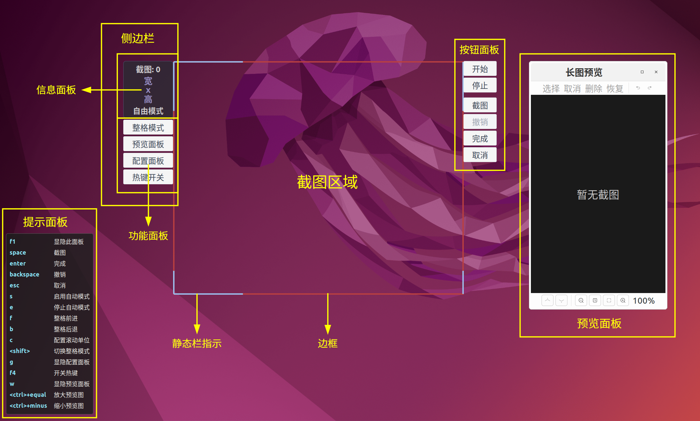

## 截图框界面

截图框由边框、截图区域和多个辅助面板构成，X11 下在屏幕上始终置顶，而 Wayland 下不一定是置顶的

- **截图区域**：框中心的透明区域。鼠标在此区域的点击和滚动会直接传递给下方的窗口
- **侧边栏**：包含信息面板和功能面板
    - **信息面板**：显示已截图数量，已截图拼接后的总尺寸以及当前所处截图模式
    - **功能面板**：提供“整格模式”、“预览面板”、“配置面板”、“热键开关”图形化操作按钮
- **按钮面板**：提供“开始/停止”、“前进/后退”、“截图”、“撤销”、“完成”、“取消”图形化操作按钮
- **动态布局**：按钮面板和侧边栏会根据屏幕剩余空间，截图区域大小自动显示、隐藏或切换位置，以确保不影响截图操作  
  在右侧空间足够但左侧空间不够的情况下，侧边栏会转移到右边，如果右侧空间也不够了，侧边栏就会消失，而右侧如果空间不够或者已经被侧边栏占据，按钮面板会直接消失。同理，截图区域高度太少的话，侧边栏先消失功能面板，然后是信息面板

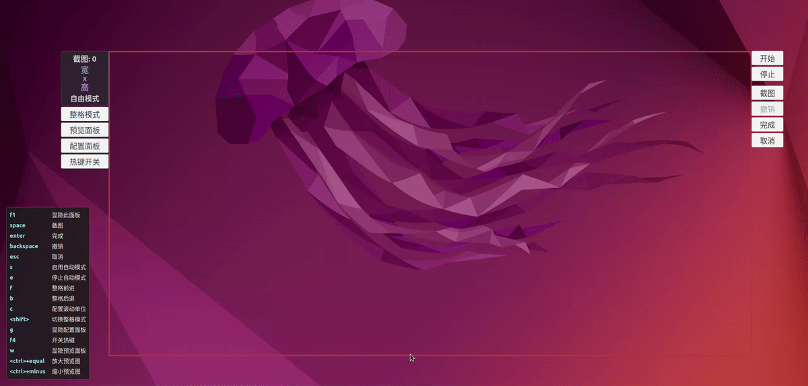

## 静态栏指示

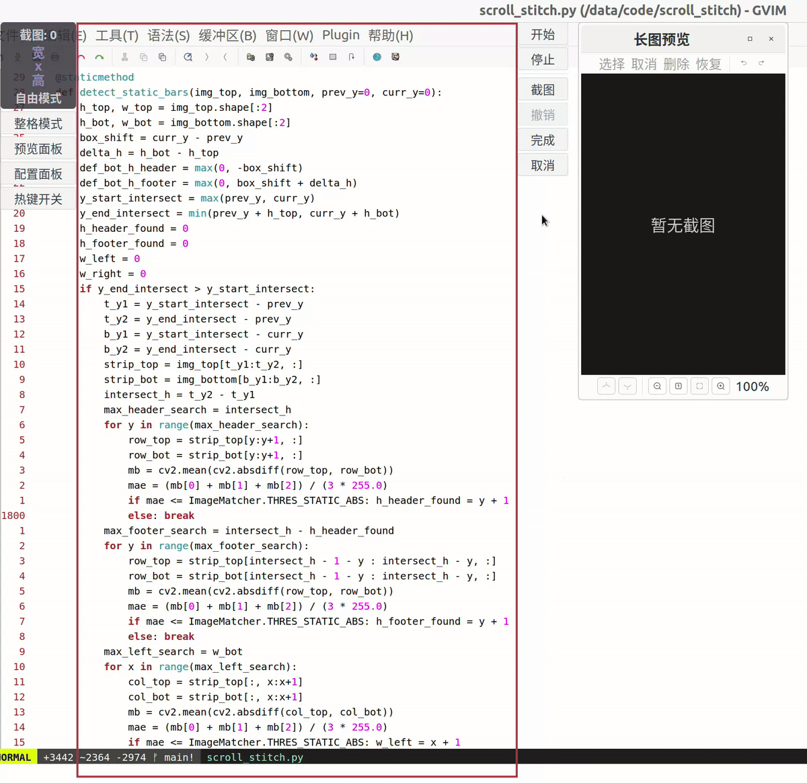

如果启用误差修正，截图时程序会对比前后两张图片，检测边缘是否存在固定区域（如顶部栏、底部栏或侧边栏），并在截图框对应边框上用蓝色指示其范围。这些识别出的区域也有可能只是纯色背景或凑巧相同的界面内容（小范围内无影响）。

为了避免对拼接产生干扰，程序会把检测到的静态栏从截图区域里剔除后再进行匹配。匹配时不支持重叠区域过大（静态栏宽度和/高度和超过图片宽/高的 60%），否则程序可能会误认为界面没有滚动。

如果当前图片中有新增的静态栏，则会对它和上一张图片的匹配造成干扰，并且由于静态栏检测依赖前后两张图片的对比，需要下一次截图时才能检测到。如果手动向上移动上边框导致当前图片包含了上一张图片里没有的顶部栏时，并且这两张图片的重叠又比较小的话，可能会导致匹配失败。

## 预览面板

预览面板中可以查看图片实时的拼接效果，并支持交互。

可以通过拉动面板边框调整面板大小，初始时面板会根据空间选择合适位置，缩放比自适应。

也可以通过底部栏按钮或快捷键缩小/放大图片（缩放系数约为 $\sqrt[3]{2}$，即放大三次后是原来的两倍，最大可以放大 4 倍以及缩小到原来的 25%）。放大/缩小中间的两个按钮分别用于重置缩放比例回 100% 和让缩放比自适应宽度。在自适应宽度模式下，图片只会自动缩小以适应宽度，当视口宽度大于图片宽度时，图片会以 100% 的缩放比居中而不是被拉大，一旦手动缩小/放大/重置后，就会自动退出自适应宽度模式。

鼠标左键按住允许拖动图片，使用滚轮可以滚动图片，底部栏最左边的两个按钮分别是滚动图片到顶/底部。在图片内容更新的时候，图片如果原先就在底部，则更新后也会自动滚动到底部。

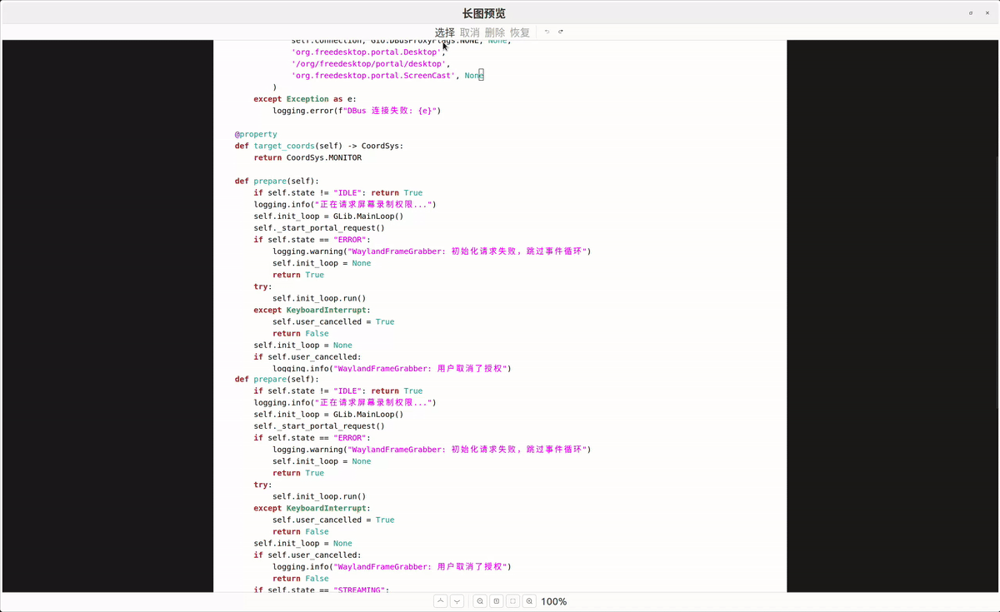

点击预览面板顶部栏上的选择按钮可以进入选择模式，在选择模式下可以选中图片中固定宽度的某一区域。在新建选区或调整已有选区时，如果将鼠标移动到视口的上下边缘之外，图片会自动滚动（鼠标偏离越远，滚动速度越快），以便于选中较长的区域。

选中某一区域，可能发现它里面有蓝色或紫色的虚线，虚线处叫做接缝，就是两张图片的拼接处的地方，蓝色意味着程序认为这两张图片之间有重叠，紫色则意味着没有（可能是恢复后的接缝，也可能是没有计算重叠或计算失败），由于程序在拼接时可能出错，所以内容可能会重复或缺失。重复的内容可以删除，缺失的部分则可以先对它进行恢复，然后再对恢复后的选区进行删除。

预览面板顶部栏右侧的图标按钮用于撤销和重做“删除”与“恢复”操作，如果进行了新的编辑操作，则之前的重做记录会被清空，如果撤销了截图导致有编辑操作无效，程序会自动清理并清空重做记录。

## 提示面板

提示面板的位置是固定的，位于屏幕的左下角，它会显示当前的快捷键配置并通过透明度区分当前可用与不可用的快捷键（高亮为可用，暗淡为不可用）。

可以手动显示/隐藏提示面板，如果显示的话，提示面板会根据选框和面板的位置动态显/隐。

## 截图模式

### 自由模式

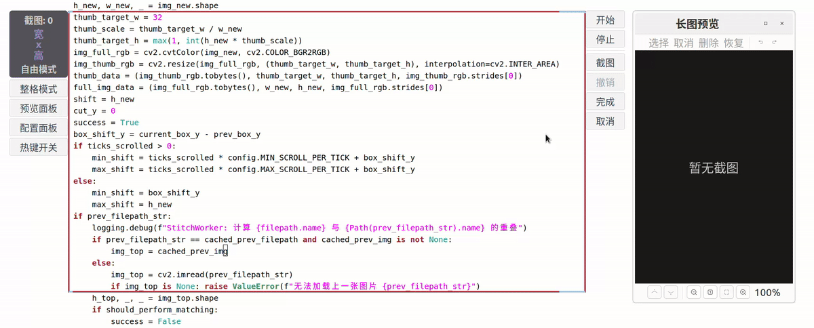

自由模式是程序启用时默认的模式。在自由模式下如果启用误差修正的话，程序会计算两次截图间的像素偏移量，并在重叠区域内计算最佳拼接点，最后按位移对齐并修剪这两张图片（因此上面图片的底部栏和下面图片的顶部栏在这个过程中会被裁切掉），如果匹配失败或者未启用误差修正的话，则程序会将前后两张图片直接拼接到一起。

自由模式下截图框的边框可以自由拖动，截图框的高度也可以是范围内的任意像素数。

### 自动模式

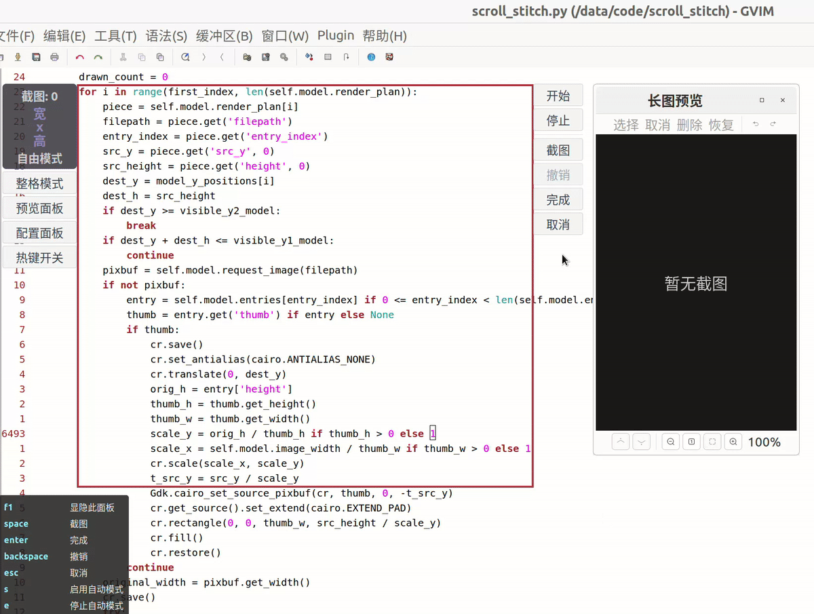

开启自动模式后，程序会自动滚动并截图拼接，可以通过快捷键或按下鼠标左键来停止自动模式。

开启自动模式时如果没有截图，程序会先截图再滚动，如果原来有截图，则程序会先滚动再截图。停止自动模式时，如果程序最后执行的是滚动，则会延迟截图一次以确保预览图与屏幕当前区域一致。默认每次滚动两格，最好确保截图区域高度大于两格。

当程序检测到界面内容无太大变化时（有误检的可能性，比如说如果界面固定元素占比太大的话），会认为到达页面底部而自动停止。

### 整格模式

要对一个应用窗口启用整格模式，必须先配置它的滚动单位，否则开启不了，每个应用都需要单独配置，建议只对经常需要长截图的应用配置。滚动单位就是在这个应用窗口中鼠标滚轮滚动一格时，屏幕内容滚动的距离的缓冲区像素数（可能会出现同一个窗口的不同区域滚动单位不一致以及缩放后滚动单位变化的情况）。

启用整格模式后，如果不启用误差修正的话，首先截图框的高度会变到最近的整数倍滚动单位，然后调整截图区域大小的时候，截图框的高度也只能是滚动单位的整数倍，整格模式前进/后退的行为分别是截图后前进一个截图区域的高度、撤销并后退一个截图区域的高度，如果启用误差修正，则截图框的高度不会自动改变，也没有这个限制，前进/后退只会滚动约 70% 截图区域的高度。

X11 下在启用整格模式时程序会自动检测截图框中心下方窗口的应用标识符，而 Wayland 下需要先选择下方窗口的标识符（如果没有要先配置）。

整格模式相当于一种半自动模式，对于已经配置好了的应用窗口，可以通过长按快捷键连续执行前进动作直到松开，从而快速截取很长的区域内容。

## 界面操作

- **区域选择与调整**：截图框四边四角在没有截图的时侯是可以自由拖动的

  拖动左边框（上边框）是保持截图框宽度（高度）不变，然后移动截图框的位置，拖动右边框（下边框）是保持左边框（上边框）的位置不变，改变截图框的宽度（高度），所以拖动左上角就相当于保持截图框的大小不变改变位置

  在有截图的时候，截图框的宽度和左右边框的位置就锁死了（但是删除完截图之后又可以拖动了）
- **按钮功能**
    - 开始/停止：开启/停止自动模式
    - 截图：截取截图区域内容（不包括边框）
    - 撤销：删除截取的最后一张图片（如果没有截图，就什么都不做，此时也按不了撤销按钮）
    - 完成：将截图拼接成一张图片并保存（完成后会有通知，点击通知上的按钮可以用程序默认查看方式打开图片或打开图片所在目录）
    - 取消：放弃已截图片并退出（退出前如果有截图会弹出退出对话框询问是否放弃截图，防止误操作，如果没有截图则直接退出）

      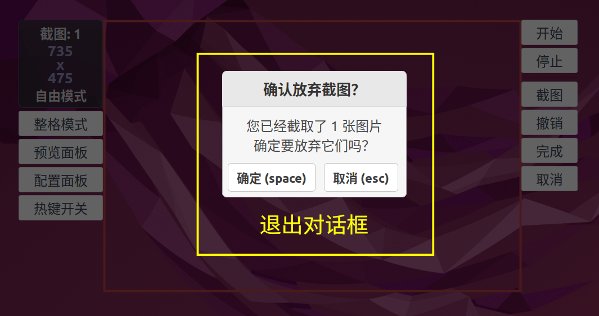
    - 前进/后退：整格模式下截图/撤销并滚动窗口内容（滚动距离跟配置有关）
    - 整格模式：切换整格模式
    - 预览面板：显示/隐藏预览面板
    - 配置面板：显示/隐藏配置面板
    - 热键开关：启用/禁用快捷键

## 快捷键

拼长图支持快捷键操作，大部分快捷键都有对应的图形按钮，其功能和按钮一致。快捷键默认设置如下：

- **主要操作**  
    - 截图：`space`
    - 撤销：`backspace`
    - 完成：`enter`
    - 取消：`esc`
- **自动模式**
    - 开始自动滚动：`s`
    - 停止自动滚动：`e`
- **整格模式**
    - 切换整格模式：`<shift>`
        - 整格前进：`f`
        - 整格后退：`b`
    - 配置滚动单位（自由模式下）：`c`

      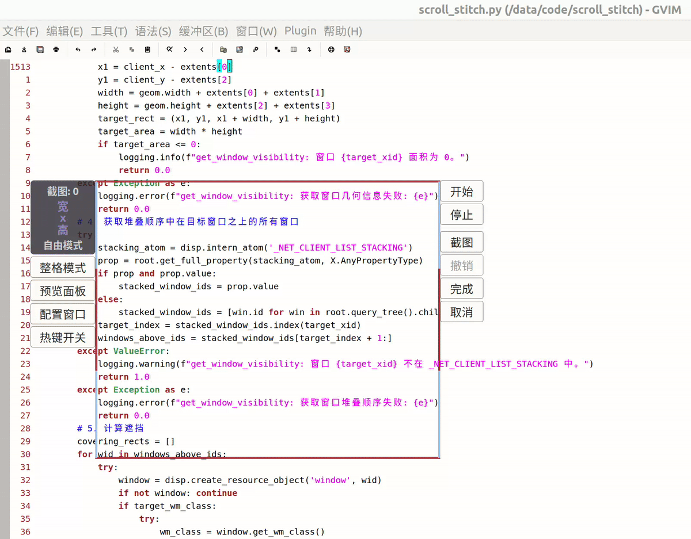

      配置前，请确保界面内容丰富、固定元素占比不大且下方有足够的滚动空间，Wayland 下还需要输入或选择下方窗口标识符，配置时，屏幕左上角会有反馈面板显示，程序会自动滚动界面，请不要移动鼠标

      配置成功后如果通知上说不需要误差修正，可以进入整格模式下拼接图片，然后在预览面板的选择模式下查看紫色接缝处的拼接效果来判断自动配置的效果。如果有偏差的话，可以打开配置面板在“整格模式校准”界面中手动调整配置再重新拼接检查效果
- **面板操作**
    - 显示/隐藏预览面板：`w`  
      若预览面板不可见则显示，若可见则隐藏
        - 放大预览图：`<ctrl>+equal`
        - 缩小预览图：`<ctrl>+minus`  
          快捷键缩放仅在预览面板可见时生效
    - 显示/隐藏配置面板：`g`  
      若配置面板不可见则显示，若可见则隐藏，如果有打开子面板（文件选择面板和颜色选择面板），子面板也会一同显/隐
    - 显示/隐藏提示面板：`f1`  
      如果隐藏，面板将不可见，如果显示，面板不一定可见，还会动态显/隐以避让选框、侧边栏以及按钮面板
- **全局操作**
    - 启用/禁用快捷键：`f4`  
      程序开始时快捷键默认启用，禁用快捷键不包括其本身
- **对话框操作**
    - 对话框确认：`space`
    - 对话框取消：`esc`

## 配置指南

拼长图提供了一个图形化配置面板，大部分行为和界面都可以通过它进行自定义，除了配置面板也可以直接修改配置文件（打开高级设置，在“系统与性能”的”路径“里可以查看当前加载的配置文件路径），配置面板里大部分配置项的修改都是立即生效，少部分需要重启才能生效（底部栏右边会有文本提示），而对配置文件的修改要下次启动时生效。

### 配置面板

配置面板中大部分配置项当鼠标悬浮在上面时都会有提示文字，而且大部分配置页面内有恢复本页默认设置的按钮，点击后可以恢复本页的设置到默认设置。

在配置面板配置快捷键以及输入的时候，程序的全部快捷键是会自动禁用的，防止错误触发。

面板底部栏有显示高级设置的按钮，打开可以配置一些高级设置，“主题外观”、“系统与性能”以及“整格模式校准”这三个页面完全属于高级设置范围，只有开启该开关后，才会显示入口。

#### 输出设置

##### 常用配置

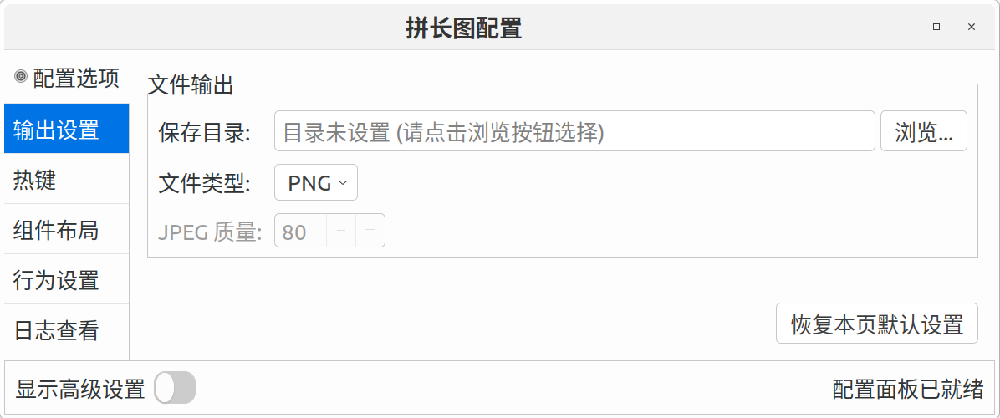

文件类型：

- **JPEG**：JPEG 格式理论尺寸上限为 65535 像素，底层实现（`libjpeg-turbo`）限制最大为 65500 像素，如果保存时图片尺寸超过了该限制，程序会终止完成流程并提示

##### 高级配置

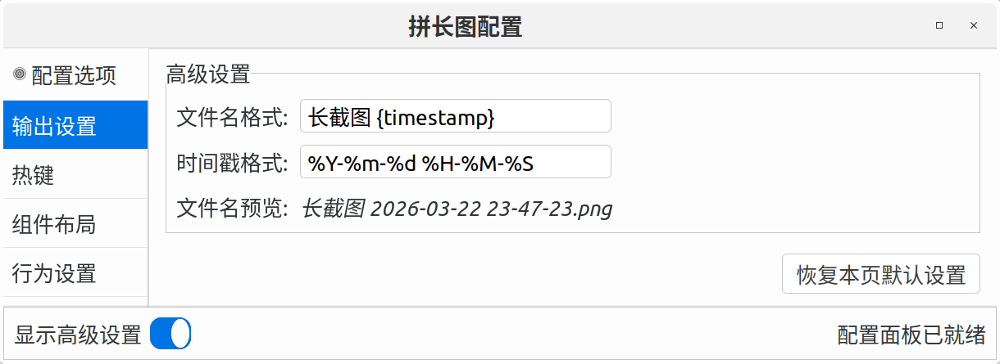

#### 热键

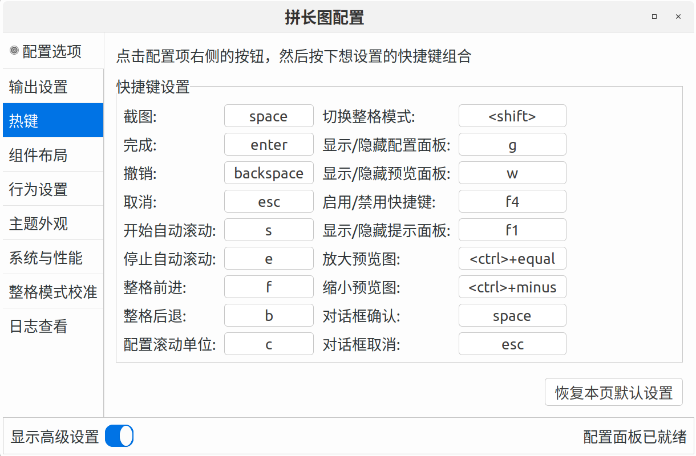

- **修饰键**：支持 `shift`、`alt`、`ctrl`、`super`
- **主键**：支持主键盘区上的字母键（`a` - `z`）和数字键（`0` - `9`），一些特殊键（`f1` - `f12`、`space`、`enter`、`tab`、`backspace`、`esc`、`minus`、`equal`、`up`、`down`、`left`、`right`、`page_up`、`page_down`、`home`、`end`、`insert`、`delete`、`print`），不支持小键盘上的数字键和符号键

快捷键可以配置为单键或者多修饰键 + 单主键的模式，单键支持单主键和单独的修饰键。快捷键的触发不受大写锁定键状态的影响，但是组合快捷键需要先按修饰键再按主键

X11 下不建议将快捷键设置为 `super` 加主键的形式，部分环境下可能需要按住 `super` 键并连按两次主键快捷键才会生效，而且容易和系统快捷键冲突，但是可以将 `super` 键和其他修饰键一起用

点击配置项旁边的按钮后再按下快捷键组合即可完成设置，中途可以再次点击按钮取消录制快捷键，如果按下了无效的快捷键组合，程序会自动恢复到先前的快捷键

#### 组件布局

##### 常用配置

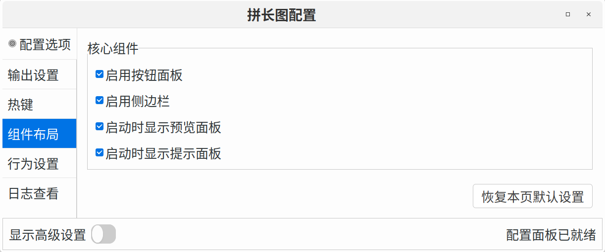

##### 高级配置

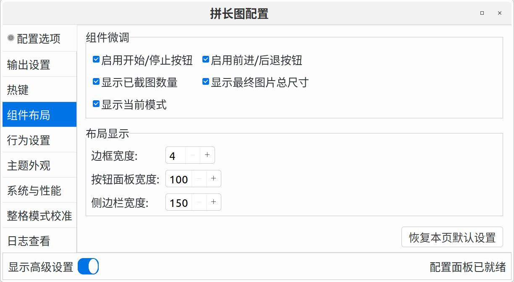

- **边框宽度**：不仅影响视觉外观，还决定了边框拖拽的难易程度，只有当鼠标停在边框上时，才能按下左键拖动并调整选区

#### 行为设置

##### 常用配置

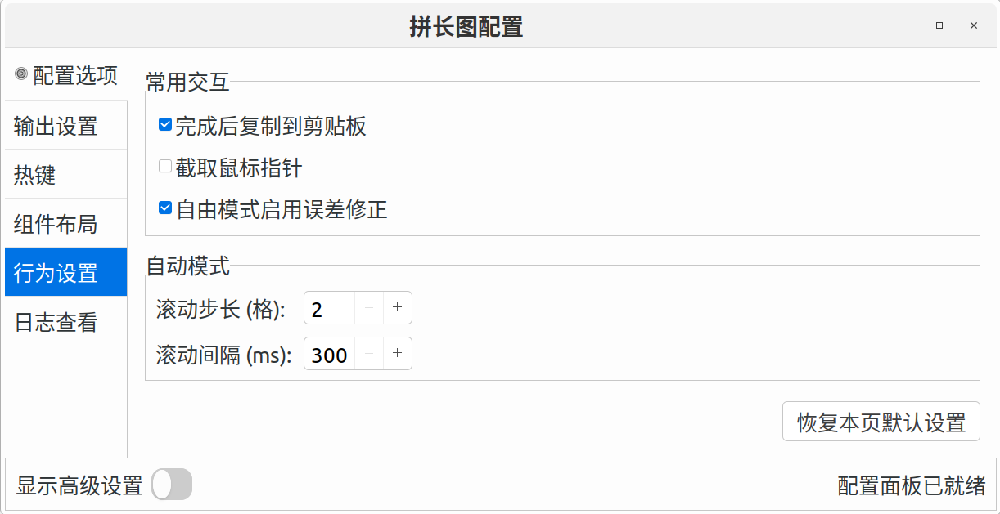

- **完成后复制到剪切板**：如果图片原始数据过大（大于 500MB），则只会复制图片文件路径到剪切板
- **截取鼠标指针**：Wayland 下的修改需要重启才能生效，这个配置项只在自由模式下生效，自动模式和整格模式不支持截取鼠标指针（因此如果 Wayland 下启动时配置为截取鼠标指针，则这两个模式截图时程序会自动将鼠标移动到截图区域之外）

##### 高级配置

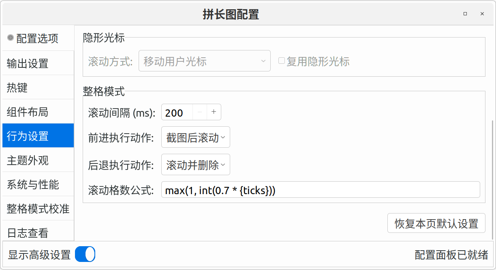

滚动方式：

- **移动用户光标**：兼容性好，但是会临时接管并移动用户光标，干扰体验
- **使用隐形光标（实验性）**：创建一个独立的虚拟指针设备来执行滚动，对用户光标位置无影响，仅支持 X11

从移动用户光标切换到使用隐形光标时，程序会立即创建隐形光标，而从使用隐形光标切换回移动用户光标时，程序不会立即删除隐形光标，而是要等到程序退出时再清理。

在选择使用隐形光标的前提下，如果勾选复用隐形光标，则程序退出时不会删除隐形光标（可以看到屏幕的右下角停放着光标），取消勾选的话，程序除了在退出时会删除主设备外，在开始的时候也会清理之前残余的隐形光标设备

需要注意的是：程序删除主设备时可能会造成界面卡顿几到十几秒（更加严重的甚至会导致退出登录），另外，由于多指针焦点的问题，也可能导致某些应用无法输入或者无法滚动界面（可能需要点击聚焦后才能滚动）的问题

#### 日志查看

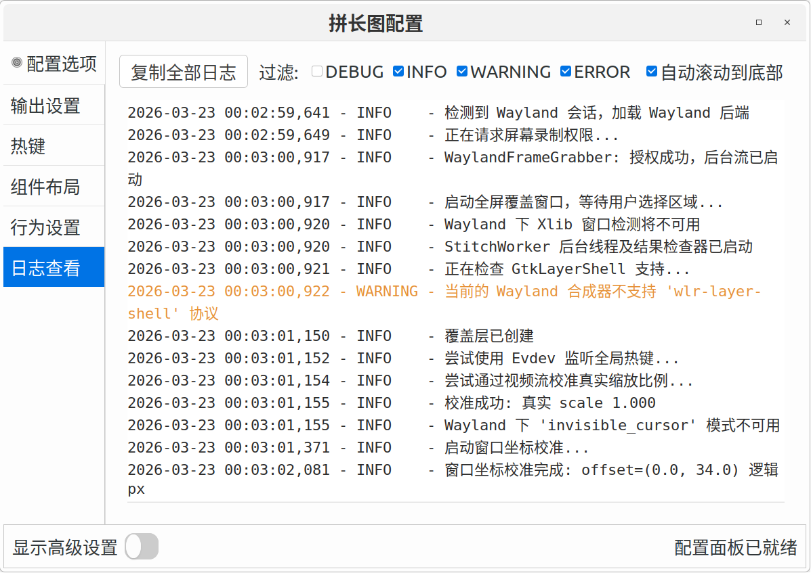

日志查看可以用来看程序运行时输出的日志，包括标准输出和标准错误，不同等级日志有不同颜色，默认不开启 DEBUG 级别的日志（但是点击按钮复制的日志里面是包含的）。如果勾选了自动滚动并且日志文本没有获得焦点，则每次更新（包括有新内容和过滤日志的时候）都会自动滚动到底部。

如果程序运行错误连配置面板都打不开的话，可以在终端运行命令查看程序输出，以及查看日志文件（默认是 `~/.scroll_stitch.log`）。

#### 主题外观

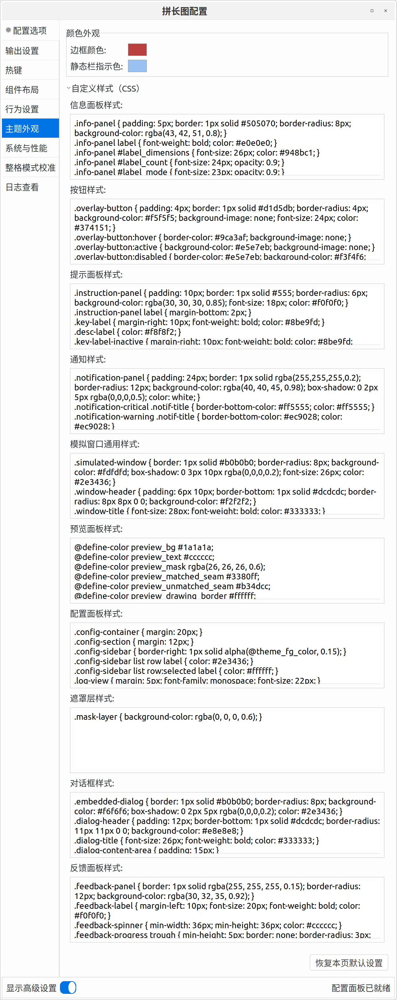

- **颜色外观**：右侧对应的颜色按钮显示的是当前配置的颜色，点击会弹出颜色选择面板可以自定义颜色
- **自定义样式**：需要使用 GTK3 CSS 语法，编辑后输入框失焦会自动保存并应用样式，如果有语法错误则会保持原样式

#### 系统与性能

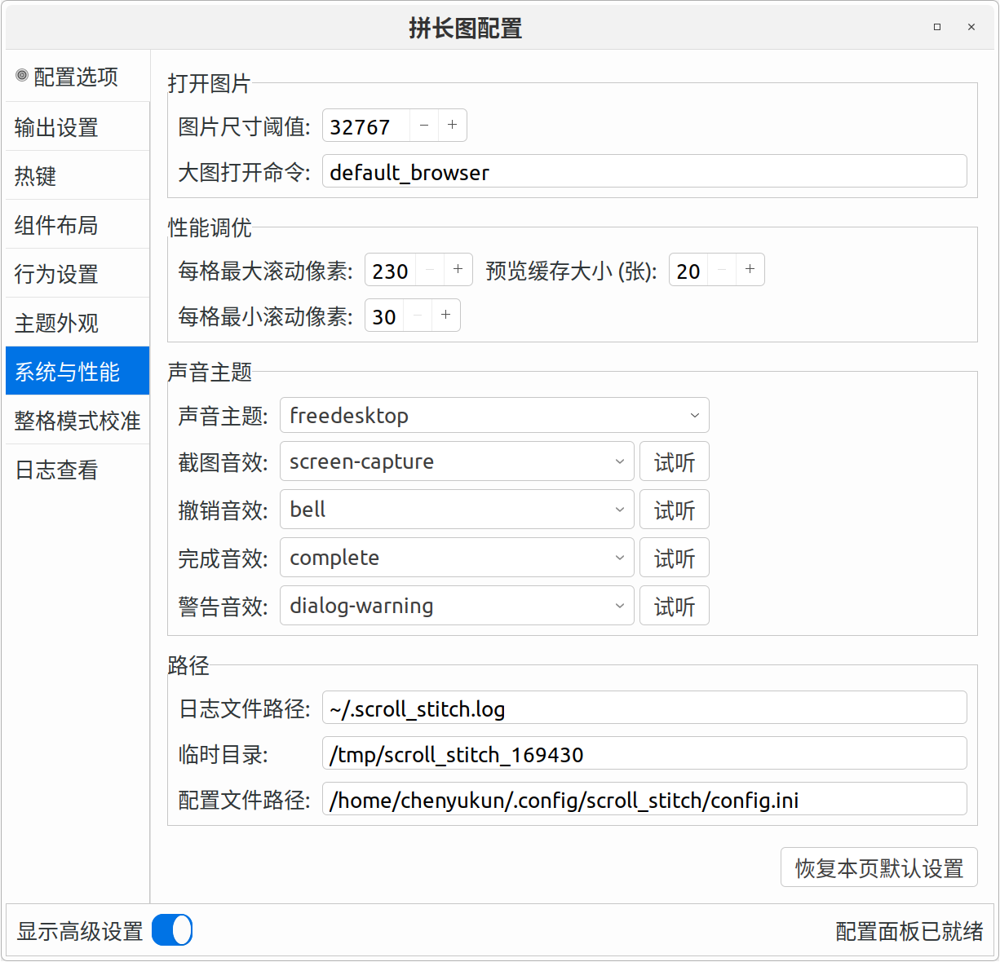

- **打开图片**
    - 图片尺寸阈值：用“大图打开命令”打开图片的阈值，并不是限制图片宽度或高度的最大值
    - 大图打开命令：默认的图片查看软件可能渲染不了单边尺寸太大的图片，这个时候可以用自定义的命令打开图片  
      如果 `{filepath}` 里有空格的话，命令中要用引号包裹。如果直接键入 `default_browser` 则会用浏览器打开图片
- **声音主题**
    - 声音主题：如果下拉列表中没有可选的声音主题，需要安装 `sound-theme-freedesktop` 包
- **性能调优**
    - 每格最大滚动像素：设置鼠标滚轮滚动一格的最大缓冲区像素值，需要不小于实际滚动单位
    - 每格最小滚动像素：设置鼠标滚轮滚动一格的最小缓冲区像素值，可以大于实际滚动单位

      每格最大滚动像素和每格最小滚动像素用于限制匹配和校准的搜索范围，设置一个合理的范围可以减少干扰并且减少程序拼接用时，如果出现两张图片除去静态栏还有一些重叠（不是太少）但程序匹配失败的情况，可以尝试调大每格最大滚动像素

    - 预览缓存大小：设置预览面板在内存中保留的图片张数，不是硬性限制，实际缓存的不会少于当前视口内图片数量，当图片滚动到未缓存的区域时，会先加载模糊的缩略图占位，再异步加载实际图片
- **路径**
    - 日志文件路径：修改后需要重启程序才能生效
    - 临时目录：当前实例根据模板生成的存放截图文件的目录，修改需要编辑配置文件中对应的模板

#### 整格模式校准

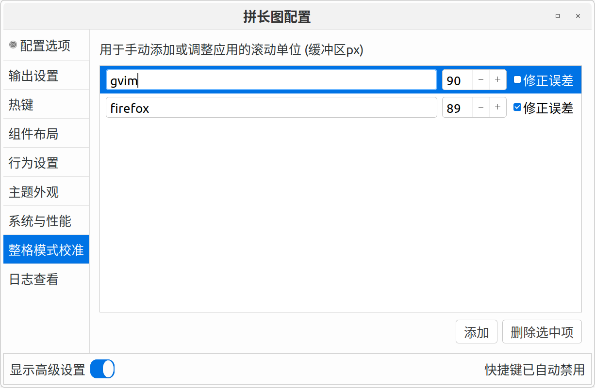

滚动配置修改后会立即生效。在整格模式下，如果修改当前正在应用的滚动配置，不启用误差修正的情况下改变滚动单位则截图框的高度会自动对齐到新配置，如果直接删除该项配置，则程序会恢复到自由模式

### 配置文件

除了配置面板里有的，配置文件还包含少部分配置面板里没有的配置项，下面仅介绍这部分配置项

#### `[Behavior]`

- `calibration_samples = 4`：滚动单位自动校准时的采样次数，适当调大可以让校准结果更准确，但会增加校准耗时
- `hotkey_debounce_time = 0.25`：快捷键防抖时间（单位：秒），防止快捷键在短时间内连续触发

#### `[Interface.Layout]`

单位：逻辑px

- `preview_panel_height = 750`：预览面板初始高度
- `config_panel_height = 800`：配置面板初始高度
- `notification_width = 520`：通知宽度
- `feedback_widget_width = 200`：反馈面板宽度
- `file_chooser_height = 800`：文件选择面板初始高度
- `min_selection_size = 40`：截图区域初始选区和自由模式下调整大小时的最小宽/高限制

#### `[System]`

- `temp_directory = /tmp/scroll_stitch_{pid}`：临时目录模板，`{pid}` 会被替换为当前进程 id

#### `[Preview]`

- `preview_drag_sensitivity = 2.0`：鼠标左键按住并拖动预览图的移动灵敏度
- `preview_autoscroll_sensitivity = 1.0`：选择模式下拖拽选区，鼠标超出视口边缘时，触发预览图自动滚动的速度灵敏度
- `preview_zoom_factor = 1.26`：预览图放大/缩小的比例因子
- `preview_min_zoom = 0.25`：预览图最小缩放比例
- `preview_max_zoom = 4.0`：预览图最大缩放比例
- `preview_resize_handle_size = 10`：选择模式下，判定鼠标是否落在选框上下边线的范围大小（单位：逻辑px）

#### `[Performance]`

- `thres_score = 5.0`：图像匹配算法的分数阈值  
  适当调高会使匹配验证更严格，能减少错误拼接的概率，但是可能导致匹配失败而直接拼接，适当调低则会放宽验证条件，能减少匹配失败的情况，但会增加错误拼接的概率
- `thres_texture = 3.0`：纹理丰富度阈值  
  程序在匹配时会过滤掉缺乏纹理的区域，适当调高能减少这些区域对匹配的干扰并加快搜索速度，适当调低能让程序在特征较少的区域尝试匹配，但是会增加错误拼接的概率

---

[< 返回主页](../)
