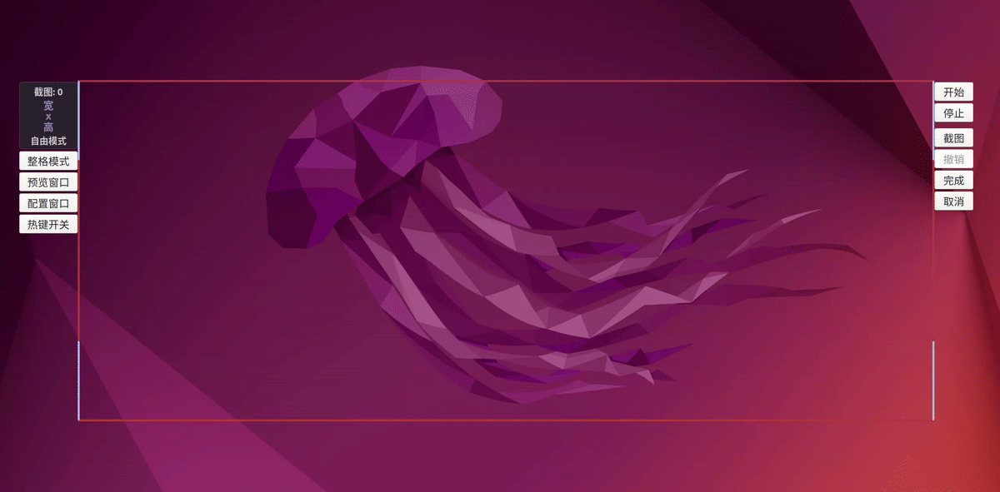
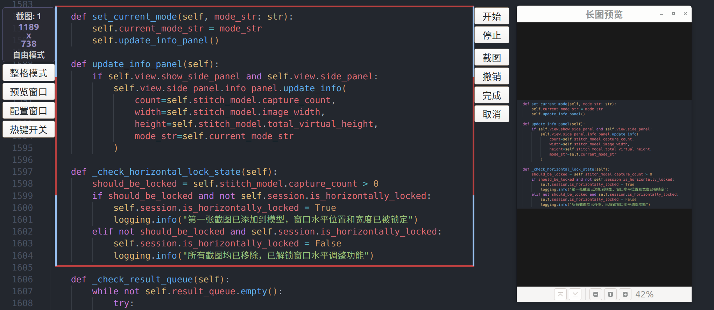
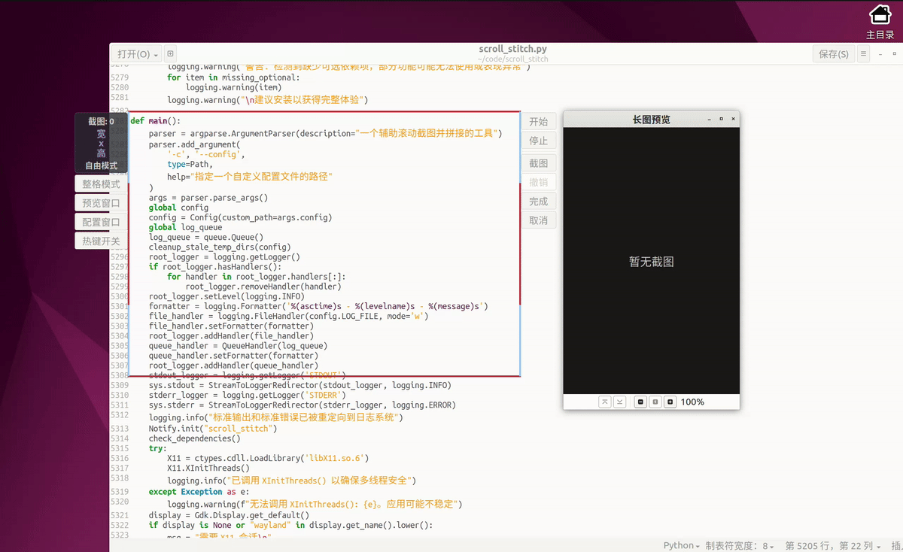
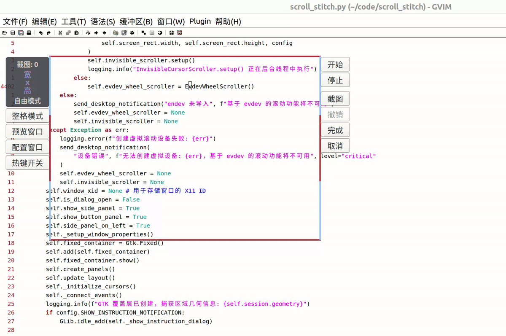
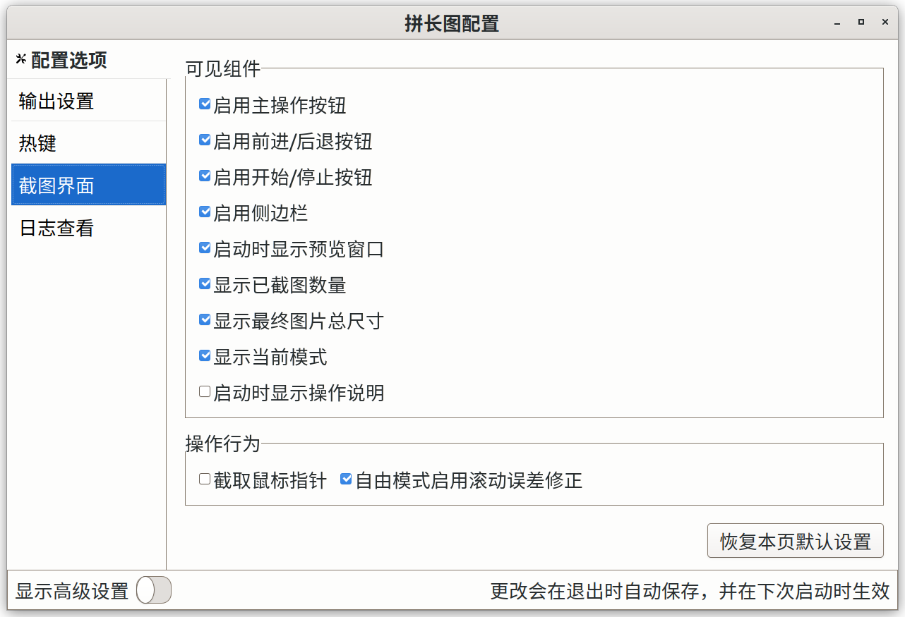
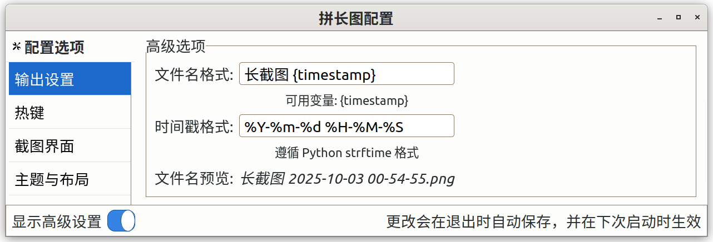
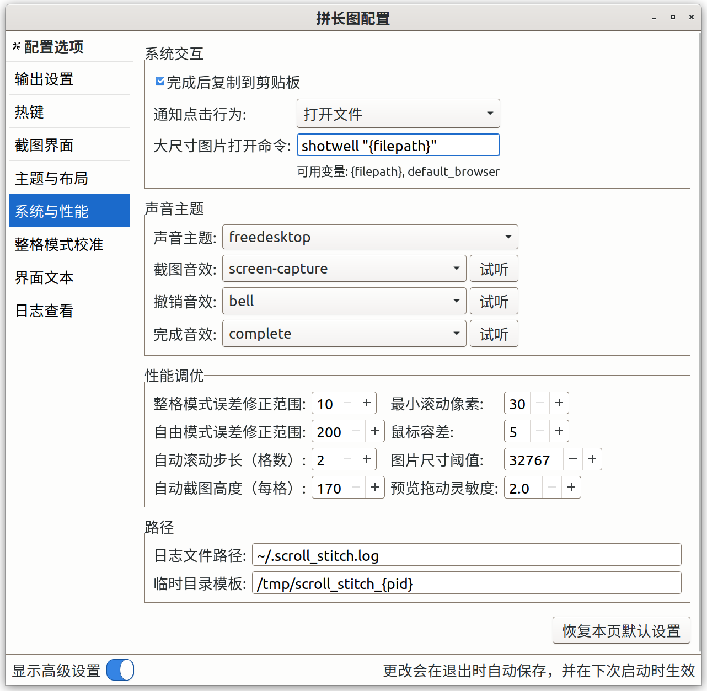
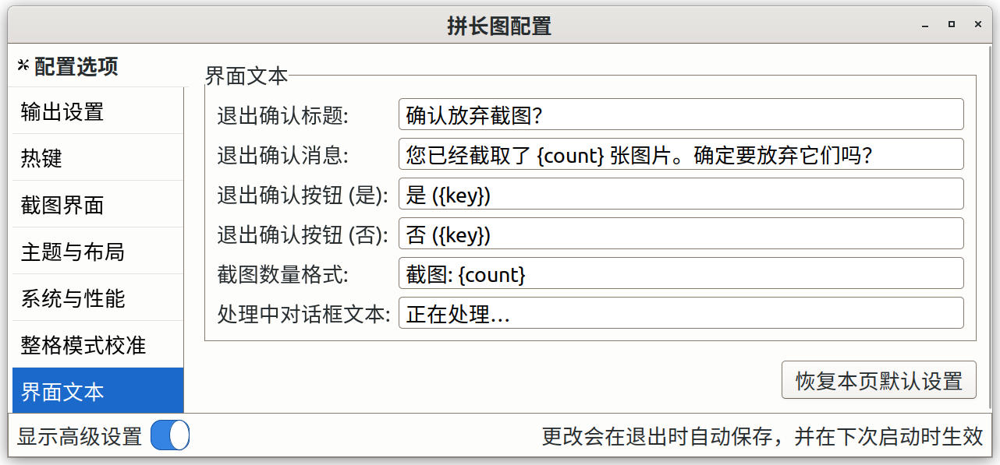

[< 返回主页](../README.md)

- [详细介绍](#详细介绍)
    - [主窗口界面](#主窗口界面)
	- [误差修正](#误差修正)
	- [预览窗口](#预览窗口)
    - [截图模式](#截图模式)
	    - [自由模式](#自由模式)
      - [自动模式](#自动模式)
	    - [整格模式](#整格模式)
    - [核心操作](#核心操作)
    - [默认快捷键](#默认快捷键)
    - [配置指南](#配置指南)
        - [常用配置](#常用配置)
		    - [输出设置常用配置](#输出设置常用配置)
		    - [热键](#热键)
		    - [截图界面常用配置](#截图界面常用配置)
		    - [日志查看](#日志查看)
        - [高级配置](#高级配置)
		    - [输出设置高级配置](#输出设置高级配置)
		    - [截图界面高级配置](#截图界面高级配置)
			- [主题与布局](#主题与布局)
		    - [系统与性能](#系统与性能)
		    - [整格模式校准](#整格模式校准)
		    - [界面文本](#界面文本)

# 详细介绍

下面介绍的是拼长图默认配置的界面与行为，如果想修改配置可以看下面的[配置指南](#配置指南)

## 主窗口界面

主窗口由边框、截图区域和多个辅助面板构成，在屏幕上始终置顶

- **截图区域**：窗口中心的透明区域。鼠标在此区域的点击和滚动会直接传递给下方的窗口（点击会使主窗口失去焦点而使下方窗口获得焦点）
- **侧边栏**：位于主窗口左侧，包含信息面板和功能面板
    - **信息面板**：显示已截图数量，已截图拼接后的总尺寸以及当前所处截图模式
	- **功能面板**：提供“整格模式”、“预览窗口”、“配置窗口”、“热键开关”图形化操作按钮
- **按钮面板**：位于主窗口右侧
    - **按钮面板**：提供“开始/结束”、“前进/后退”、“截图”、“撤销”、“完成”、“取消”图形化操作按钮
- **动态布局**：按钮面板和侧边栏会根据屏幕剩余空间，截图区域大小自动显示、隐藏或切换位置，以确保不影响截图操作。 在右侧空间足够但左侧空间不够的情况下，侧边栏会转移到右边，如果右侧空间也不够了，侧边栏就会消失，而如果右侧空间不够，按钮面板会直接消失。同理，截图区域高度太少的话，侧边栏先消失功能面板，然后是信息面板

## 误差修正

启动误差修正后，左右边框的上下部分会变成蓝色（下面变色部分的高度即为误差范围，如果误差范围大于截图区域高度的一半，则整个左右边框都会是蓝色）。

截图时不用准确地将界面滚动一个截图区域的高度才能无缝拼接，只需要将图片在下边框附近的内容移动到上边框附近的蓝色区域内就行（不能向上移出蓝色区域），范围内的误差将会被自动修正，但是启用该功能会增加部分拼接用时。

整格模式的每个应用都有单独的误差修正开关以及一个总的误差范围，自由模式也有一个开关和误差范围，切换自由模式和整格模式会切换误差范围，导致蓝色边框高度变化。

通常整格模式下的误差较小，基本只有几个像素，有些应用则没有误差，所以误差范围不用太大，自由模式的误差范围也不建议太大，增大误差范围会增加拼接用时。

## 预览窗口

预览窗口中可以查看图片实时的拼接效果，并支持交互。

可以通过拉动窗口边框调整窗口大小，初始化时窗口会根据空间选择合适位置，图片比例自动缩小以适应窗口宽度（除非手动，否则不会因此放大）。但是一旦手动改变图片比例后，图片比例将不会再自适应窗口宽度。

也可以通过底部栏按钮缩小/放大图片（缩放系数约为 $2^{1/3}$，即放大三次后是原来的两倍，最大可以放大 4 倍以及缩小到原来的 25%），放大/缩小中间的按钮是重置图片比例回 100%，除了使用按钮放大/缩小图片，也可以使用快捷键，但是只在预览窗口有焦点的时候有效。

鼠标左键按住允许拖动图片，使用滚轮可以滚动图片，底部栏最左边的两个按钮分别是滚动图片到顶/底部。

在图片内容更新的时候，图片如果原先就在底部，则更新后也会自动滚动到底部，部分时候可能会出现图片应当却未滚动到底部的情况，可以手动滚动到底部，也可以等下次更新（这时一般会自动滚动到底部了）。

点击预览窗口顶部栏上的选择按钮可以进入选择模式，在选择模式下可以选中图片中固定宽度的某一区域，然后可以对选区进行删除，也可以进行恢复。还可以通过旁边的图标按钮进行撤销和重做。

选中某一区域，可能发现它里面有蓝色或紫色的虚线，虚线处叫做接缝，就是两张图片的拼接处的地方，蓝色意味着程序认为这两张图片之间有重叠，紫色则意味着没有（可能是恢复后的接缝，也可能是没有计算重叠或计算失败），由于程序在拼接时可能出错，所以内容可能会重复或缺失。重复的内容可以删除，缺失的部分则可以先对它进行恢复，然后再对恢复后的选区进行删除。

## 截图模式

### 自由模式

自由模式是程序启用时默认的模式。

自由模式下主窗口的边框可以自由拖动，窗口的高度也可以是范围内的任意像素数

#### 自动模式

开启自动模式后，程序会自动滚动并拼接，可以通过快捷键或较大幅度的移动鼠标来停止自动模式。

程序默认每次滚动两格后截取图片下面部分，最好确保截图区域高度大于两格。

当程序检测到界面内容无太大变化时（有误检的可能性，比如说如果界面底部有固定元素的话），会认为到达页面底部而自动停止。

### 整格模式

整格模式是一种特殊的截图模式，要对一个应用窗口启用整格模式，必须先配置它的滚动单位，否则开启不了，每个应用都需要单独配置，建议只对经常需要长截图的应用配置。滚动单位就是在这个应用窗口中鼠标滚轮滚动一格时，屏幕滚动的距离的像素数（可能会出现同一个窗口的不同区域滚动单位不一致的情况）。

启用后，首先主窗口的高度会变到最近的整数倍滚动单位，然后调整截图区域大小的时候，主窗口的高度也只能是滚动单位的整数倍，整格模式前进/后退的行为分别是截图后前进一个截图区域的高度、尝试删除最后一张图片并后退一个截图区域的高度。 

对于已经配置好了的应用窗口，整格模式下可以快速截取很长的区域内容，但是在有些应用中即使滚动单位设置到效果最好的整数，上下两张图片还是不能完全重合，会有很小的一丝误差，这种情况可以在配置窗口中启用该应用的误差修正功能（如果没有滚动误差不建议启用该功能，不仅会增加部分拼接时间，可能还会导致部分内容被压缩）。

## 核心操作

- **区域选择与调整**：主窗口四边四角在没有截图的时侯是可以自由拖动的  
  
  

  拖动左边框（上边）是保持窗口宽度（高度）不变，然后移动窗口的位置，拖动右边框（下边）是保持左边框（上边框）的位置不边，改变窗口的宽度（高度），所以拖动左上角就相当于保持窗口的大小不变改变位置  
  
  在有截图的时候，窗口的宽度和左右边框的位置就锁死了（但是删除完截图之后又可以拖动了）
- **按钮功能**
	- **截图**：截取截图区域内容（不包括边框）
	- **撤销**：删除截取的最后一张图片（如果没有截图，就什么都不做，此时也按不了撤销按钮）
	- **完成**：将截图拼接成一张图片并保存（完成后会有桌面通知，点击通知会用默认查看方式打开图片）
	- **取消**：放弃已截图片并退出（退出前如果有截图会弹出确认对话框，防止误操作，如果没有截图则直接退出）
    - **前进/后退**：整格模式下截图/撤销并将窗口滚动一个截图区域的高度
    - **整格模式**：切换整格模式
    - **预览窗口**：激活/隐藏预览窗口
    - **配置窗口**：激活/隐藏配置窗口
    - **热键开关**：启用/禁用全局热键

## 默认快捷键

拼长图支持快捷键操作，默认设置如下：

- **主要操作**  
  这些快捷键和对应的图形按钮的功能是一样的
	- 截图：`space`
	- 撤销：`backspace`
	- 完成：`enter`
	- 取消：`esc`
- **退出对话框操作**  

  

  退出对话框是在取消时，弹出的一个对话框，询问用户是否放弃截图
	- 退出对话框确认：`space`
	- 退出对话框取消：`esc`
- **模式与工具**
    - 开始自动滚动：`s`
    - 停止自动滚动：`e`
    - 切换整格模式：`<shift>`
        - 整格前进：`f`
        - 整格后退：`b`
	- 配置滚动单位 （自由模式下）：`c`  
	  
	  
	  
	  配置前，请确保下边框附近内容丰富且下方有足够的滚动空间，配置时，屏幕左上角会有对话框显示，程序会自动滚动界面，请不要移动鼠标
    - 激活/隐藏预览窗口：`w`  
      
      若预览窗口不可见则激活（不存在则创建），若可见（根据面积计算的窗口可视度大于 50%）则隐藏
        - 预览窗口放大：`<ctrl>+equal`
        - 预览窗口缩小：`<ctrl>+minus`
      
        预览窗口放大/缩小快捷键仅在预览窗口有焦点时有效
    - 激活/隐藏配置窗口：`g`  
      
      若配置窗口不可见则激活（不存在则创建），可见则隐藏
    - `f4`: 启用/禁用全局热键  
      
      程序开始时全局热键默认启用，禁用全局热键不包括其本身（当主窗口本身拥有焦点时，所有快捷键还是会生效）。

## 配置指南

拼长图提供了一个图形化配置窗口，大部分界面和行为都可以通过它进行自定义，更改会在退出自动保存，除了配置窗口也可以直接修改配置文件 `config.ini` ，两种方式的修改都是下次启动时生效。  

配置窗口中大部分配置项当鼠标悬浮在上面时都会有提示文字，而且在配置窗口配置快捷键以及输入的时候，程序的全局热键是会自动禁用的，防止错误触发。  

大部分选项界面内有恢复本页默认设置的按钮，点击后可以恢复本页的设置到默认设置。

### 常用配置

#### 输出设置常用配置

#### 热键

快捷键可以配置为单键或者多修饰键 + 单主键的模式，单键支持单字母/数字键，单独的修饰键（不支持单独的 `super` 键），一些特殊键（`f1` - `f12`，上下左右箭头键，`minus`，`equal`，`plus`、`space`，`backspace`，`enter`，`esc`），修饰键支持 `ctrl`、`alt`、`shift`、 `super`，主键包括上面提到的除修饰键之外的所有键

不建议将快捷键设置为 `super` 加主键的形式，需要按住 `super` 键并连按两次主键快捷键才会生效，而且容易和系统快捷键冲突，但是可以将 `super` 键和其他修饰键一起用

如果按下无效的快捷键组合，程序会自动恢复到先前的快捷键

#### 截图界面常用配置

- 截取鼠标指针：取消勾选则截图的时候鼠标会短暂隐形（会造成鼠标闪烁一下），目前不支持截取鼠标指针

#### 日志查看

日志查看可以用来看程序运行时输出的日志，包括标准输出和标准错误，不同等级日志有不同颜色。如果勾选了自动滚动到底部，则每次更新日志区（包括有新内容和过滤日志的时候）都会自动滚动。  

如果程序运行错误连配置窗口都打不开的话，可以在终端运行命令查看程序输出，以及查看日志文件（默认是 `~/.scroll_stitch.log` ）。

### 高级配置

窗口底部栏有显示高级设置的按钮，打开可以配置一些高级设置。

#### 输出设置高级配置

#### 截图界面高级配置

滚动方式：

- 移动用户光标：兼容性好，但是会临时接管并移动用户光标，干扰体验
- 使用隐形光标（实验性功能）：创建一个独立的虚拟指针设备来执行滚动，对用户光标位置无影响

勾选复用隐形光标设备后，则程序退出时不会删除隐形光标（可以看到屏幕的右下角停放着光标），取消勾选的话，程序除了在退出时会删除主设备外，在开始的时候也会清理之前残余的隐形光标设备，所以如果一开始选择了复用隐形光标但是后面不想留着这个隐形光标了的话，可以先取消勾选后再启动一次程序，这样就可以清理了

需要注意的是：程序删除主设备时可能会造成界面卡顿几到十几秒，另外，由于多指针焦点的问题，也可能导致隐形光标或用户鼠标无法滚动界面（需要点击一下要滚动的窗口才能滚动）以及用户鼠标在该窗口范围内消失（点击一下窗口即可显示）的问题

#### 主题与布局

#### 系统与性能

- 大尺寸图片打开命令：执行终端命令打开图片，默认的图片查看软件可能渲染不了单边尺寸太大的图片，这个时候可以用自定义的命令打开图片  

  如果 `{filepath}` 里有空格的话，命令中要用引号包裹。如果直接键入 `default_browser` 则会用浏览器打开图片
- 声音主题：需要安装 `sound-theme-freedesktop` 才能找到声音主题
- 自动截图高度（每格）：设置的鼠标滚轮滚动一格的最大像素值，自动模式下程序会据此截图（从底部往上截取滚动格数乘以这个像素值的高度）
- 最小滚动像素：设置的鼠标滚轮滚动一格的最小像素值，自动模式下程序会据此进行图片拼接（太大会导致拼接效果不理想，太小会增加拼接用时）
- 图片尺寸阈值：用“大尺寸图片打开命令”打开图片的阈值，并不是限制图片宽度或高度的最大值

#### 整格模式校准

#### 界面文本

---

[< 返回主页](../README.md)
