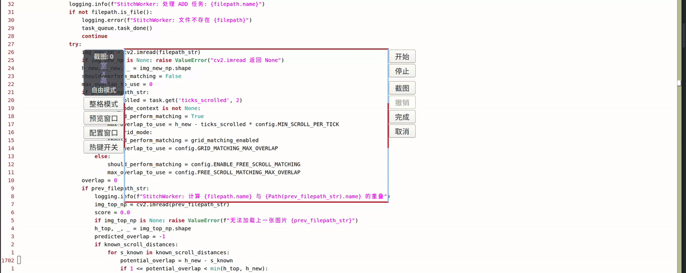
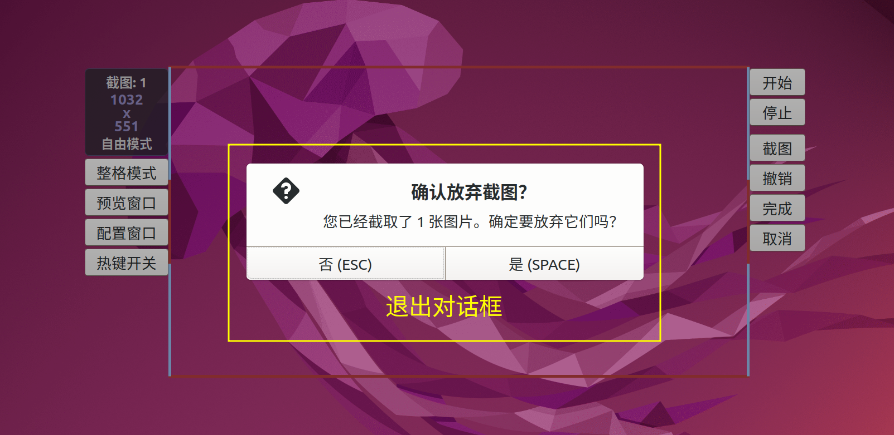
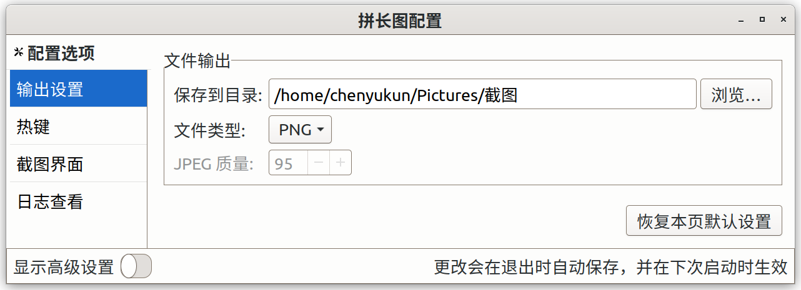
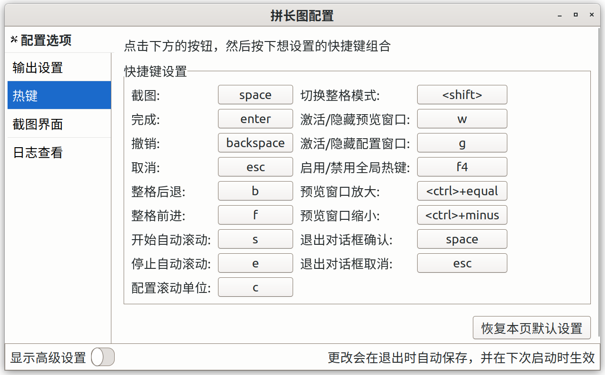
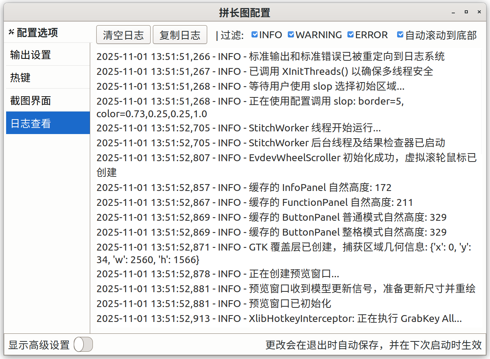
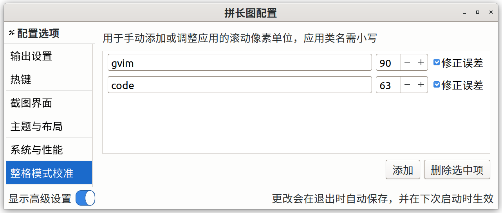

[< 返回主页](../README.md)

- [详细介绍](#详细介绍)
    - [主窗口界面](#主窗口界面)
	- [误差修正](#误差修正)
    - [截图模式](#截图模式)
	    - [整格模式](#整格模式)
	    - [自由模式](#自由模式)
    - [核心操作](#核心操作)
    - [默认快捷键](#默认快捷键)
    - [配置指南](#配置指南)
        - [常用配置](#常用配置)
		    - [输出设置常用配置](#输出设置常用配置)
		    - [热键](#热键)
		    - [截图界面常用配置](#截图界面常用配置)
		    - [日志查看](#日志查看)
        - [高级配置](#高级配置)
		    - [输出设置高级配置](#输出设置高级配置)
		    - [截图界面高级配置](#截图界面高级配置)
			- [主题与布局](#主题与布局)
		    - [系统与性能](#系统与性能)
		    - [整格模式校准](#整格模式校准)
		    - [界面文本](#界面文本)

# 详细介绍

下面介绍的是拼长图默认配置的界面与行为，如果想修改配置可以看下面的[配置指南](#配置指南)

## 主窗口界面

主窗口由边框、截图区域和多个辅助面板构成，在屏幕上始终置顶

* **截图区域**：窗口中心的透明区域。鼠标在此区域的点击和滚动会直接传递给下方的窗口（点击会使主窗口失去焦点而使下方窗口获得焦点）
* **滑块条**：位于主窗口左侧，鼠标可以按住并拖动滑块，松开时会根据拖动距离相应地滚动截图区域中心下的窗口
* **侧边栏**：位于主窗口右侧，包含信息面板和按钮面板
    * **信息面板**：显示已截图数量，以及已截图拼接后的总尺寸
    * **按钮面板**：提供“前进”、“后退”、“截图”、“撤销”、“完成”、“取消”图形化操作按钮
* **动态布局**：滑块条和侧边栏会根据屏幕剩余空间，截图区域大小自动显示、隐藏或切换位置，以确保不影响截图操作。 在左侧空间足够但右侧空间不够的情况下，侧边栏会转移到左边，如果左侧空间也不够了，侧边栏就会消失，而如果左侧空间不够，滑块条会直接消失。同理，截图区域高度太少的话，侧边栏先消失按钮面板，然后是信息面板

## 误差修正

启动误差修正后，左右边框的上下部分会变成蓝色（下面变色部分的高度即为误差范围，如果误差范围大于截图区域高度的一半，则整个左右边框都会是蓝色）。

截图时不用准确地将界面滚动一个截图区域的高度才能无缝拼接，只需要将图片在下边框附近的内容移动到上边框附近的蓝色区域内就行（不能向上移出蓝色区域），范围内的误差将会被自动修正，但是启用该功能会增加部分拼接用时。

整格模式的每个应用都有单独的误差修正开关以及一个总的误差范围，自由模式也有一个开关和误差范围，切换自由模式和整格模式会切换误差范围，导致蓝色边框高度变化。

通常整格模式下的误差较小，误差范围不用太大，自由模式的误差范围也不建议太大，增大误差范围会增加拼接用时。

## 截图模式

### 整格模式

整格模式是一种特殊的截图模式，要对一个应用窗口启用整格模式，必须先配置它的滚动单位，否则开启不了，每个应用都需要单独配置，建议只对经常需要长截图的应用配置。滚动单位就是在这个应用窗口中鼠标滚轮滚动一格时，屏幕滚动的距离的像素数。

启用后，首先主窗口的高度会变到最近的整数倍滚动单位，然后调整截图区域大小的时候，主窗口的高度也只能是滚动单位的整数倍，在整格模式下前进/后退的行为分别是前进一个截图区域的高度再截图、后退一个截图区域的高度并尝试删除最后一张图片。 

但是想要的区域高度并不一定刚好是整数倍截图区域高度，可以前进到接近结束（或超过部分）时就启用自由模式，下面手动截图（或撤销最后一张图，并重新截取想要的区域）。

对于已经配置好了的应用窗口，整格模式下可以快速截取很长的区域内容，但是在有些应用中即使滚动单位设置到效果最好的整数，上下两张图片还是不能完全重合，会有很小的一丝误差，这种情况可以在配置窗口中启用该应用的误差修正功能（如果没有滚动误差不建议启用该功能，不仅会增加部分拼接时间，可能还会导致部分内容被压缩）。

### 自由模式

自由模式就是非整格模式，是程序启用时默认的模式。

自由模式和整格模式区别就是：自由模式下主窗口的边框可以自由拖动，窗口的高度也可以是范围内的任意像素数，以及前进/后退的行为变成了前进/后退一个固定的距离。

## 核心操作

* **区域选择与调整**：主窗口四边四角在没有截图的时侯是可以自由拖动的  
  
  

  拖动左边框（上边）是保持窗口宽度（高度）不变，然后移动窗口的位置，拖动右边框（下边）是保持左边框（上边框）的位置不边，改变窗口的宽度（高度），所以拖动左上角就相当于保持窗口的大小不变改变位置  
  
  在有截图的时候，窗口的宽度和左右边框的位置就锁死了（但是删除完截图之后又可以拖动了）
* **按钮功能**
	* **截图**：截取截图区域内容（不包括边框）
	* **撤销**：删除截取的最后一张图片（如果没有截图，就什么都不做，此时也按不了撤销按钮）
	* **完成**：将截图拼接成一张图片并保存（完成后会有桌面通知，点击通知会用默认查看方式打开图片）
	* **取消**：放弃已截图片并退出（退出前如果有截图会弹出确认对话框，防止误操作，如果没有截图则直接退出）
	* **前进/后退**：自由模式下固定距离滚动窗口（默认距离较小，在不支持平滑滚动的窗口可能连续好几下才能滚动界面一下），整格模式下将窗口滚动一个截图区域的高度并截图/撤销

## 默认快捷键

拼长图支持快捷键操作，默认设置如下：

* **主要操作**  
  这些快捷键和对应的图形按钮的功能是一样的，比如 `f` / `b` 快捷键在自由模式和整格模式的行为也和“前进/后退”按钮一样是变化的
	* 前进：`f`
	* 后退：`b`
	* 截图：`space`
	* 撤销：`backspace`
	* 完成：`enter`
	* 取消：`esc`
* **退出对话框操作**  

  

  退出对话框是在取消时，弹出的一个对话框，询问用户是否放弃截图
	* 退出对话框确认：`space`
	* 退出对话框取消：`esc`
* **模式与工具**
	* 启用/禁用整格模式：`<shift>`
	* 配置滚动单位 （自由模式下）：`s`  
	  
	  
	  
	  先将内容向上滚动，使得原先位于截图框底部的内容，恰好移动到截图框的顶部。然后记住这个过程中的鼠标滚轮滚动的格数，按下快捷键在对话框中输入并确定，程序会自动计算并写入配置文件，下次启动时配置生效，但是一般来说会有误差，需要后续在配置窗口中微调
	* 打开/激活配置窗口：`g`  
	  
	  若配置窗口不存在则创建配置窗口，若已存在则将配置窗口激活
	* `f4`: 启用/禁用全局热键  
	  
	  程序开始时全局热键是默认启用的，`f4` 可以禁用全局热键（不包括其本身和打开/激活配置窗口），但是当主窗口本身拥有焦点时，所有快捷键还是会生效。

## 配置指南

拼长图提供了一个图形化配置窗口，大部分界面和行为都可以通过它进行自定义，更改会在退出自动保存，除了配置窗口也可以直接修改配置文件 `config.ini` ，两种方式的修改都是下次启动时生效。  

配置窗口中大部分配置项当鼠标悬浮在上面时都会有提示文字，而且在配置窗口配置快捷键以及输入的时候，程序的全局热键是会自动禁用的，防止错误触发。  

大部分选项界面内有恢复本页默认设置的按钮，点击后可以恢复本页的设置到默认设置。

### 常用配置

#### 输出设置常用配置

#### 热键

快捷键可以配置为单键或者多修饰键 + 单主键的模式，单键支持单字母键，单独的修饰键，一些特殊键（`f1` - `f12`，上下左右箭头键，`space`，`backspace`，`enter`，`esc`），修饰键支持 `ctrl`、`alt`、`shift`，主键包括上面提到的除修饰键之外的所有键

#### 截图界面常用配置

1. 启用“前进/后退”按钮：包括整格模式和自由模式（如果想单独控制自由模式下“前进/后退”按钮的显示与否，请使用下面的选项）
2. 自由模式下启用滚动功能：控制自由模式下是否启用“前进/后退”按钮和快捷键（如果启用“前进/后退”按钮的状态是关闭的，这个选项打开了，自由模式下的“前进/后退”按钮也不会出现，但是自由模式下“前进/后退”的快捷键会生效）
3. 截取鼠标指针：取消勾选则截图的时候鼠标会短暂隐形（会造成鼠标闪烁一下）

#### 日志查看

日志查看可以用来看程序运行时输出的日志，包括标准输出和标准错误，不同等级日志有不同颜色。如果勾选了自动滚动到底部，则每次更新日志区（包括有新内容和过滤日志的时候）。  

如果程序运行错误连配置窗口都打不开的话，可以在终端运行命令查看程序输出，以及查看日志文件（默认是 `~/.scroll_stitch.log` ）。

### 高级配置

窗口底部栏有显示高级设置的按钮，打开可以配置一些高级设置。

#### 输出设置高级配置

#### 截图界面高级配置

滚动方式：

* 移动用户光标：兼容性好，但是会临时接管并移动用户光标，干扰体验
* 使用隐形光标：创建一个独立的虚拟指针设备来执行滚动，对用户光标位置无影响，但是程序退出时删除主设备可能会造成界面卡顿几到十几秒

#### 主题与布局

#### 系统与性能

* 大尺寸图片打开命令：执行终端命令打开图片，默认的图片查看软件可能渲染不了单边尺寸太大的图片，这个时候可以用自定义的命令打开图片  

  如果 `{filepath}` 里有空格的话，命令中要用引号包裹。如果直接键入 `default_browser` 则会用浏览器打开图片
* 声音主题：需要安装 `sound-theme-freedesktop` 才能找到声音主题
* 自由滚动步长：自由模式下“前进/后退”滚动的固定步长  
  
  步长太小的话，在一些不支持平滑滚动的应用窗口中无法滚动一格，可能需要快速连续滚动几次才能滚动一格（默认步长较小）
* 图片尺寸阈值：用“大尺寸图片打开命令”打开图片的阈值，并不是限制图片宽度或高度的最大值

#### 整格模式校准

#### 界面文本

---

[< 返回主页](../README.md)
